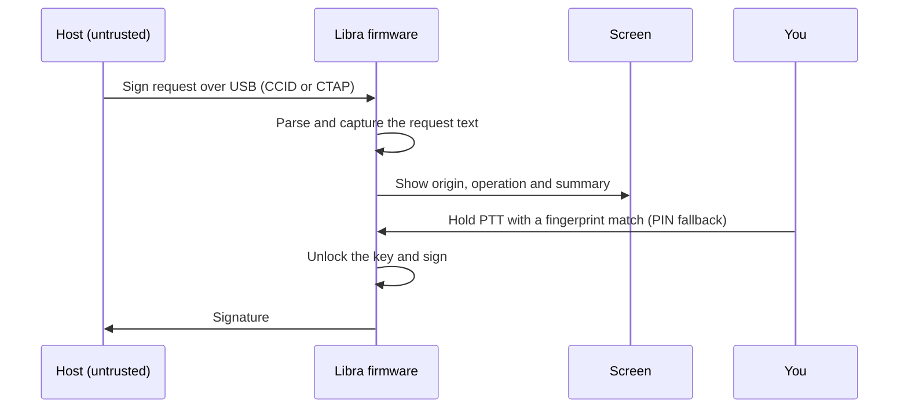
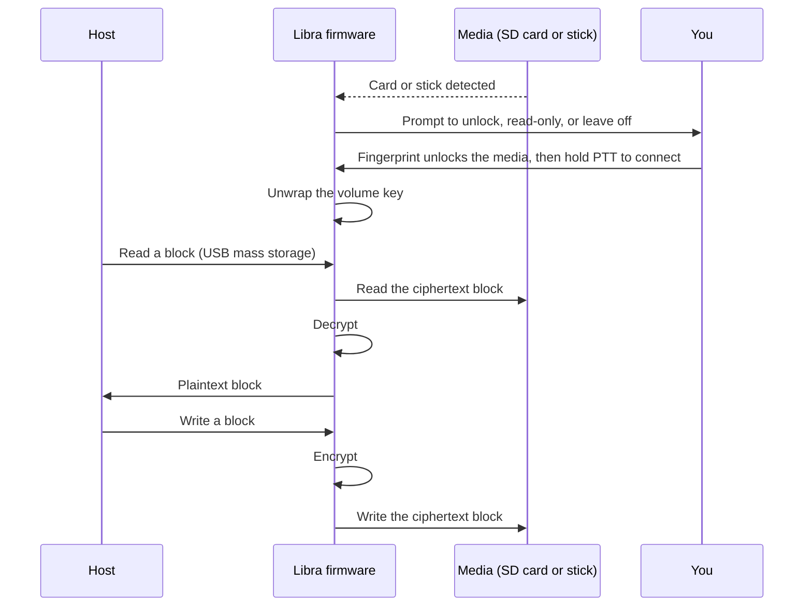
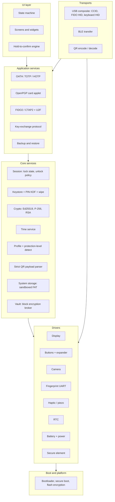
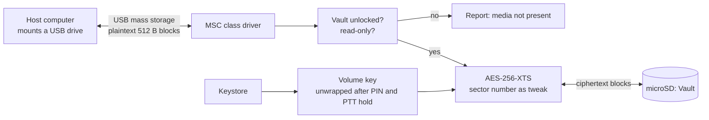

# Libra v0 (beta): complete design document

A handheld, open-hardware device that is an **OTP manager**, an **open security
key** (FIDO2 + OpenPGP card), an **in-person GPG key-signing tool**, and an
**encrypting storage broker** (the "Vault"). Candidate additions modelled on
the Foundation Passport Prime (a signer for a Bitcoin wallet, an identity card)
are listed in [Concept and goals](#concept) and are not committed.

| | |
|---|---|
| Version | **v0 (beta)**: the design for a breadboard build of all the components, powered over USB, while the PCB is prepared. **v1** is the actual device (PCB, case, battery), pared down and designed with a designer, and **will get its own document**. This document describes v0. |
| Status | Concept / design. **Nothing is built or tested.** |
| Target MCU | ESP32-S3 (module) |
| Licence intent | Hardware CERN-OHL, firmware open (licence TBD, depends on reused code) |
| Convention | *(verify)* marks a claim I could not confirm. Treat it as a task, not a fact. Parts and library names are proposals. |

Contents

- [Concept and goals](#concept)
- [Decision log](#decisions)
- [System architecture](#system-architecture)
- [Mechanical layout](#mechanical)
- [Electrical design](#electrical)
- [Parts list](#parts)
- [Crypto profiles](#crypto-profiles)
- [User interface](#user-interface)
- [Key-exchange protocol](#key-exchange)
- [Software architecture](#software-architecture)
- [Security architecture](#security)
- [Backup and recovery](#backup)
- [Build, test and manufacturing](#build-test)
- [Roadmap](#roadmap)
- [Risks](#risks)
- [Open questions](#open-questions)
- [Reference links](#references)

---

## Concept and goals {#concept}

### What it is {#what-it-is}
A YubiKey is a headless token. Libra has a **screen, a rear camera and
buttons**, so it can:
- show you exactly what you are approving (a *trusted display*, which malware on the host cannot fake),
- work standalone, with no computer, for in-person key signing and OTP setup,
- also plug into a computer and act as a security key.

### Functions {#functions}
| # | Function | Notes |
|---|---|---|
| 1 | Share my GPG public key / fingerprint | QR on screen; keep it in sync with a keyserver via the host companion |
| 2 | Sign someone's key in person | QR exchange + proof of key possession + trusted-screen signing |
| 3 | Enrol OATH accounts (TOTP/HOTP) | Scan the provisioning QR with the rear camera ([OATH support](#oath)) |
| 4 | Act as a security key when plugged in | FIDO2/U2F and OpenPGP card |
| 5 | Decrypt/sign on the desktop | Provided by the OpenPGP card applet: desktop `gpg` does the work, no custom code. **Goal: unlock with your fingerprint** instead of typing the card PIN ([Fingerprint](#fingerprint)) |
| 6 | Encrypted storage broker ("Vault") | An SD card in the Vault slot, and a USB stick in the second USB port (tier 1, a v0 goal), appears to the host as a drive; the device encrypts and decrypts every block, IronKey-style ([Second USB port](#second-usb-port), [Vault](#vault), [Vault data path](#vault-data-path)) |

Functions 1 to 6 are in scope for v0. Functions 7 and 8 below are **candidates under evaluation**, not commitments.

| # | Candidate function | Notes |
|---|---|---|
| 7 | Bitcoin wallet / PSBT signer (Passport Prime parity) | Scan a PSBT QR, review it on the trusted display, hold PTT to sign, show the signed QR. v0 experiment only; see the recommendation below |
| 8 | Identity card (self-asserted) | A shareable card: name, key fingerprint, pointers to a keyserver/WKD or a profile page. Shared by QR in v0. A tap-to-share NFC tag is **deferred** until v0 shows what the device is shaping up to be. Not a government ID |

### Comparisons with similar products {#comparisons}

Three products overlap parts of Libra: the **YubiKey** (security key), the
**IronKey** (encrypted storage) and the **Foundation Passport Prime** (Bitcoin
wallet and personal security platform). None of them does everything Libra
proposes, and Libra does not match any of them on its own strength.

I have not used any of these products. Facts come from vendor documentation and
search summaries (linked below); details change by model and firmware, and
claims marked *(verify)* were not confirmed.

#### Functions at a glance {#functions-at-a-glance}

| Function | YubiKey 5 | IronKey | Passport Prime | Libra (v0) |
|---|---|---|---|---|
| 1. Share my GPG key or identity | No display | No | Not listed | Yes: QR on screen |
| 2. Sign someone's key in person | No | No | Not listed | **Yes** |
| 3. Enrol OTP accounts | Yes (OATH, enrolled through a host app) | No | Yes (offline TOTP) | Yes: scan the QR with the camera |
| 4. Security key (FIDO2/U2F) | Yes | No | Yes | Yes (USB) |
| 5. OpenPGP card for desktop gpg | Yes | No | Not listed | Yes (reused firmware, *verify*) |
| 6. Encrypted storage | No | **Yes, built in** | Yes, built in | Yes, on SD or USB media you own (slower) |
| 7. Bitcoin wallet | No | No | **Yes** | Candidate (v0 experiment) |
| 8. Identity card | PIV smart-card certificates (enterprise use, not a shareable card) | No | Not listed | Candidate |
| Display on the approval path | No | No | Yes | **Yes** |
| Open hardware and firmware | No | No | OS described as open source *(verify)* | **Yes** |

#### Libra vs YubiKey {#vs-yubikey}

*What it is:* a small headless token (USB-A or USB-C, NFC), 45 x 18 x 3.3 mm ([Yubico](https://docs.yubico.com/hardware/yubikey/yk-tech-manual/yk5-physical-attributes.html)). The 5 series offers FIDO2/U2F, PIV smart card, OpenPGP, OATH TOTP/HOTP and Yubico OTP as separate applications ([Yubico](https://docs.yubico.com/hardware/yubikey/yk-tech-manual/yk5-apps.html)).

| Capability | YubiKey 5 | Libra |
|---|---|---|
| Form factor | 45 x 18 x 3.3 mm keychain token | About 95 x 50 x 16 mm handheld (v1 estimate) |
| Protocols | FIDO2/U2F, PIV, OpenPGP, OATH, Yubico OTP | FIDO2/U2F, OpenPGP, OATH; no PIV planned |
| Stored credentials | Search summaries cite up to 100 passkeys and 64 OATH slots on newer firmware *(verify)* | Limited by storage, not yet specified |
| What you see when approving | Nothing: a touch sensor confirms without showing the request | **The request, on the screen** |
| User presence | Capacitive touch | PTT hold; fingerprint reader |
| Biometrics | Bio series has a fingerprint reader, templates in the secure element ([Help Net Security](https://www.helpnetsecurity.com/2021/10/07/yubikey-bio-series/)) | Fingerprint module (required); convenience only |
| Tamper resistance | Secure-element based | None at L1/L2; optional secure element |
| Firmware | Closed, not upgradable ([community discussion](https://discuss.privacyguides.net/t/yubikey-firmware-is-not-upgradeable/16992)) | Open and updatable (signed updates) |
| Compatibility | Widely deployed and certified | New and uncertified; some services accept only attested or certified authenticators *(verify)* |
| Other functions | None | Camera and QR, key signing, encrypted storage |

**Assessment:** Libra should not be pitched as a YubiKey replacement. A YubiKey is smaller, more mature, tamper-resistant and broadly accepted. Libra's case is a **trusted display** on the approval path, **open and auditable firmware**, and the extra functions a screen and camera allow (QR enrolment, in-person key signing, the Vault).

#### Libra vs IronKey {#vs-ironkey}

*What it is:* encrypted USB storage. The D300S uses hardware 256-bit AES-XTS, is FIPS 140-2 Level 3 certified, and locks and reformats after 10 invalid attempts ([BetaNews](https://betanews.com/2018/11/14/kingston-ironkey-d300s-serial-usb/), [datasheet](https://www.kingston.com/datasheets/IKD300S_vn.pdf)). The Keypad 200 adds an on-device keypad and epoxy-covered circuitry ([datasheet](https://www.kingston.com/datasheets/IKKP200_latam.pdf)).

| Capability | IronKey (D300S / Keypad 200) | Libra |
|---|---|---|
| Purpose | Encrypted storage only | Identity, keys, OTP, signing and encrypted storage |
| Encryption | Hardware AES-256-XTS in a dedicated controller | AES-256-XTS on the MCU (Vault) |
| Speed | USB 3 class | About 1 MB/s (tier 1); roughly 15 to 35 MB/s with a separate engine (tier 2, estimate) |
| Media | Built in, fixed capacity | **Swappable: any SD card or USB stick you own** |
| Certification | FIPS 140-2 Level 3 (D300S); FIPS 140-3 Level 3 pending (Keypad 200) | None |
| Tamper resistance | Keypad 200 epoxy-covered circuit; D300S certified Level 3 | None at L1/L2; better with the optional secure element |
| Brute-force protection | Locks and reformats after 10 bad attempts (D300S) | Wipe after N bad PINs (planned) |
| PIN entry | D300S: on the host (virtual keyboard); Keypad 200: on-device keypad | On the device, never on the host |
| Trusted display | None | Yes |
| Open design | Closed | Open hardware and firmware |

**Assessment:** where they overlap, the comparison is a sealed, certified drive with fixed capacity versus an open, slower, swappable-media broker. They suit different threat models, and Libra does not match IronKey on certified security, tamper resistance or speed.

#### Libra vs Passport Prime {#vs-passport-prime}

*What it is:* a Bitcoin wallet and personal security platform, per the announcements ([NO BS Bitcoin](https://nobsbitcoin.com/foundation-announces-passport-prime-personal-security-platform), [Foundation](https://foundation.xyz/blog/introducing-passport-prime)): multisig, taproot, PSBT and SeedQR support, a TOTP authenticator, virtual security keys over NFC or USB-C, 50 GB of storage with hardware AES-XTS, a Rust-based operating system (KeyOS), a 3.5" touchscreen, Bluetooth and NFC for backup cards. The seed is split between a security processor and a secure element and XORed with a hash of the PIN.

| Capability | Passport Prime | Libra |
|---|---|---|
| Main purpose | Bitcoin wallet plus personal security | Identity, keys, OTP, signing, encrypted storage |
| Bitcoin wallet | Yes (multisig, taproot, PSBT, SeedQR, passphrases, message signing) | Candidate; v0 experiment only |
| TOTP authenticator | Yes | Yes |
| Security keys | Yes (NFC, USB-C) | Yes (USB) |
| Encrypted storage | 50 GB, hardware AES-XTS | Vault on your own media, slower |
| OpenPGP / web-of-trust signing | Not listed | **Yes: the differentiator** |
| Security hardware | Dedicated security processor plus a secure element | Optional secure element; none fitted in v0 |
| Display and input | 3.5" touchscreen | 2.0" screen, D-pad, PTT |
| NFC | NFC for backup cards and keys | None in v0 (a read-only tag is deferred) |
| Bluetooth | Yes | BLE planned |
| Open source | OS described as open source *(verify)* | Open hardware and firmware |

**Assessment:** the Prime already covers TOTP, security keys, encrypted storage and a wallet, with dedicated security hardware Libra lacks. Libra's overlap is real but narrower, and its difference is **OpenPGP web-of-trust signing**, an open hardware design, and storage on media you own. Without a secure element Libra should not be sold as equivalent.

### Should it be a wallet, and should it be a tappable ID? {#wallet-and-id}

**Wallet.** The pieces already exist in the design (camera, QR, trusted display, keystore, PTT approval), so a PSBT signer is a modest software addition, and it is a good test of the animated-QR path. But funds change the stakes: wallet users expect a secure element, a hardened seed-backup flow and an audit, and this design's honest protection levels (L1/L2 without a secure element) fall short of that. Recommendation: **include it in v0 as an experiment**, run on top of a general "signer app" layer (see [Software architecture](#software-architecture)), and **do not make it a v1 feature unless the secure-element (L3) variant exists**.

**Digital ID.** Two different things hide under this name:
- *Self-asserted identity* (your key, your certifications, a profile pointer) fits the design and is mostly already there.
- *Government-style ID* (an ISO 18013-5 mobile driver's licence) needs an issuer to provision it and certified hardware-backed keys, so it is out of scope.

"Tappable" is not strictly required even for the standard: ISO 18013-5 uses NFC *or QR* for device engagement, then BLE for the data ([Google Wallet docs](https://developers.google.com/wallet/identity/verify/accepting-ids-from-wallet-offline)). But a simple tap-to-share needs no card emulation: a small dynamic NFC tag chip on the I2C bus that phones read as a link to your key page would do it *(verify parts such as ST25DV or NT3H)*. Recommendation: **defer the tag**: there is no NFC in v0, and it will be revisited once v0 shows what the device is shaping up to be. Keep NFC peer-to-peer out.

### Stages {#stages}

| Stage | What it is | Scope |
|---|---|---|
| **v0 (beta)** | A breadboard of all the components: ESP32-S3 dev board, camera, 2.0" screen, buttons, fingerprint module, SD slots, the USB host chip for the stick port (tier 1). **Powered over USB; no case, no battery.** Built while the PCB is prepared | As much as wanted, to learn what works: TOTP + QR, FIDO/OpenPGP, key exchange, Vault, optional wallet app |
| **v1** | **The actual device**: custom PCB, case, battery, designed with a designer. **Described in its own document**, written once v0 shows what to keep | Pared down from what v0 teaches. Decides which functions survive (the stick port is optional), whether a secure element is fitted, and the PCB and enclosure |
| **Supplementary product** | Companion app for phone and desktop ([Companion app](#companion-app)). Separate from the device and optional; v0 has only a command-line host tool | Time sync, backup, update, keyserver sync, account management |
| **v1.1 / v1.2** | Refinements once v1 exists: an **L3 secure element**, a **transparent hub pass-through** option ([Second USB port](#second-usb-port), option B), and a **solid physical design** | Then revisit **requiring the fingerprint and the PIN for all actions**, a genuine biometric factor ([Fingerprint](#fingerprint)), and the sensor choice. Not v0 or v1 |
| Later | Tier-2 storage engine, USB 3, extra apps | Only if v0/v1 justify them |

For the designer: the [Mechanical layout](#mechanical), [User interface](#user-interface) and [Pin map](#pin-map) sections hold what the electronics need. Everything else (shape, materials, button feel, screen visuals, packaging) is open to design. A "fixed constraints vs open choices" list should be added before handoff.

### Interfaces {#interfaces}

Everything the device uses to talk to you, to other people, or to a computer.

| Interface | Direction | Used for | Status |
|---|---|---|---|
| **Screen** (2.0" 240x320 IPS) | Output | Trusted display of what you are approving, QR codes, TOTP codes, menus | v0 |
| **D-pad** | Input | Move through lists, scroll details, choose among options | v0 |
| **Select** | Input | Open or choose the highlighted item (navigation) | v0 |
| **Back** | Input | Cancel, deny, go up, lock | v0 |
| **PTT** (top edge) | Input | Tap: harmless action (show my QR). Hold: commit (unlock, approve, confirm) | v0 |
| **Camera** (rear) | Input | Scan QR codes: OTP enrolment, peer keys, transaction requests | v0 |
| **Fingerprint module** (back) | Input | Convenience unlock and presence check, never the key protector | v0 (required) |
| **Haptic motor / piezo** | Output | Tick when a hold commits, feedback without looking | v0 |
| **USB-C** (host-facing) | Both | Security key (FIDO2, OpenPGP card), Vault drive, charging | v0 |
| **microSD slot: System** | Both | Logs, contacts, met log, backups, update staging | v0, proposed |
| **microSD slot: Vault** | Both | Encrypted card presented to the host as a drive | v0, proposed |
| **USB stick port** (second USB) | Both | Encrypting broker for a plugged-in USB stick ([Second USB port](#second-usb-port)) | v0 (tier 1); optional in v1 |
| **BLE** | Both | Bulk transfer of keys and signatures; off by default | v0, planned |

### Usage scenarios {#usage-scenarios}
1. **Keysigning party**: line of people, each exchange takes seconds; optional queue mode to sign afterwards.
2. **Daily login**: plug in, tap the button, done (WebAuthn, SSH sk-keys, TOTP).
3. **New account**: scan the site's QR, the device shows the 6-digit code and a countdown.
4. **Signing a commit/release**: device shows a hash/summary, you hold PTT to approve.
5. **Disaster**: device lost, restore from backup onto a new one.
6. **Encrypted stick**: plug a USB stick into the broker port, unlock with a PTT hold, use it as a normal drive; it is ciphertext without the device.
7. **Sign a transaction** *(candidate)*: scan a PSBT QR, review it on the screen, hold PTT to sign.
8. **Share my card** *(candidate)*: show my QR so a phone can scan it.

### Non-goals (v1) {#non-goals}
- **NFC / "fistbump"**: dropped; phone NFC peer-to-peer is effectively dead and QR + BLE cover the need.
- **Photo or face biometrics**: privacy risk, no security gain.
- **Keyserver/TLS logic on the device**: done by the host companion.
- **Claiming YubiKey-grade tamper resistance**: not without a secure element, and even then be careful.
- **Government-issued digital ID (mDL)**: needs an issuer and certified hardware.
- **Touchscreen**: buttons only (a designer may revisit this for v1).
- **Tap-to-pay and commercial door credentials (parked, not needed yet)**: payment cards and wallet passes need an issuer, a token provider and certification, and building-access credentials need provisioning by the access-control owner. See Deferred ideas.

### Design principles {#design-principles}
1. Open everything, buy-able parts, hand-assemblable.
2. Trusted display: consequential actions are shown and approved on the device.
3. Honest limits: every key shows where it lives and how well it is protected.
4. Shallow UI: context chooses the action; two menu levels maximum.
5. Reuse proven FIDO2/OpenPGP firmware; do not invent crypto.

---

## Decision log {#decisions}

| Area | Decision | Reason |
|---|---|---|
| Hardware openness | Open hardware (CERN-OHL), open firmware | Trust and community |
| MCU | **ESP32-S3** on a dev board | Camera interface (LCD_CAM), PSRAM, native USB OTG, secure boot + flash encryption, BLE |
| v0 base board | **Espressif ESP32-S3-DevKitC-1 (confirmed), the standard dev kit, with a quad-PSRAM or no-PSRAM module**, and modular components wired to it: a camera breakout, a display module and the other modules. Specialised boards are not used because their pinouts are hard to find | The pin audit in [Base board audit](#base-board-audit): the Waveshare camera board leaves 2 free GPIOs, while the DevKitC-1 with two I/O expanders fits the plan. The assignments were checked against Espressif's header map ([Header map](#header-map)). A documented specialised board may be reconsidered for v1 |
| Core language | C on ESP-IDF + TinyUSB | A composite CCID + HID device is not practical in MicroPython. MicroPython optional for UI prototyping only |
| Exchange medium | QR (camera and screen) for exchange; BLE for payloads too large for one QR, **off by default**, enabled deliberately, paired with a numeric comparison shown on the device | NFC peer-to-peer dropped; QR and BLE cover the need ([Key-exchange protocol](#key-exchange), [Companion app](#companion-app)) |
| Crypto | Optional profiles with hardware-limit alerts; Ed25519 default | RSA is slow on an MCU |
| Protection levels | **L0 to L3 badge, detected at boot, never over-claiming** (L0 unencrypted dev mode, L1 PIN-derived encrypted storage, L2 plus secure boot and flash encryption, L3 key in a secure element). Every key shows where it lives | Honest limits are a design principle ([Protection levels](#protection-levels), [Crypto profiles](#crypto-profiles)) |
| Secure element | **Not fitted in v0.** The firmware reports its protection level (L0 or L1) and shows a dev-mode banner | Keeps v0 simple; the optional footprint and L2/L3 are explored later ([Security architecture](#security)) |
| Face controls | Screen, D-pad, Select, Back | Navigation |
| PTT | **One dedicated button, separate from the face controls**; tap = harmless, hold = commit | Matches the camera-shutter motion and keeps acting on the world apart from navigating the device |
| Select vs PTT | Both kept: **Select navigates the device, PTT acts on the world** | "Game Boy with a walkie-talkie button". Test on the v0 breadboard whether users mix them up |
| Camera placement | Rear-facing, with the screen as the viewfinder | Aim it like a phone camera |
| Fingerprint | **Required: a separate module** (R503 or Adafruit 4750), not integrated into the PTT. Choose between them by thickness and availability | An integrated puck needs unproven thickness and click mechanics. Revisit later. Required hardware makes its thickness a firm constraint ([v1 target layout](#v1-layout)) |
| Fingerprint role | **Goal: a real biometric factor, to unlock GPG with your fingerprint.** Today: convenience and presence, never the key protector. Policy: PIN once per power-up, then fingerprint plus a PTT hold per operation, configurable per action. Stronger stages (match on the device, then an authenticated or secure-element-paired sensor) come later; sensor choice driven by fidelity is a v1-or-later decision. v0 uses the R503 or 4750 | Hobby sensor modules report matches over an unauthenticated link and can be spoofed; the staged path in [Fingerprint](#fingerprint) reaches a genuine factor without over-claiming |
| Approval model | **Two gates.** *Unlock*: the PIN, entered on the device, after power-up (and after the idle timeout). *Approval*: **hold PTT with a fingerprint match** for anything consequential; a tap is harmless (showing my QR and viewing a code need no gate); the PIN is the fallback if the fingerprint will not match. For the Vault and the stick port the approval is split in two: the fingerprint unlocks the media, a PTT hold connects it. Hold duration scales with risk (about 0.5 s login, 1.5 s signing or deleting); the request is captured when the hold starts and any change resets it; haptic or audible tick at commit | Trusted display plus two different gates defeats host-side swaps and pocket presses ([Two gates](#two-gates), [Hold-to-confirm](#hold-to-confirm)). The fingerprint is a convenience factor and the PIN protects the keys ([Fingerprint](#fingerprint)), an accepted limit |
| Unlock policy | Combo 8 to 16 presses (default 10); 10 bad unlocks with growing delays then wipe, counter written before each check; lock after 60 s idle (15 s to 10 min); host requests held about 30 s while locked; Argon2id tuned to about 1 s | Software-level defaults for v0, tuned on the build; honest about the L1 offline limit ([Session and unlock policy](#session-policy)) |
| Build plan | v0 is brought up one module at a time against a checklist (USB, I2C, buttons, display, camera, fingerprint, SD cards, Vault, stick port), with unlock-policy, Vault and Argon2id timing tests added | A staged build finds wiring and bus problems early ([v0 bring-up checklist](#bring-up)) |
| Backup encryption | A random recovery key (about 130 bits) generated by the device, shown as Base32 groups and a QR; paper by default, OS-keyring storage in the companion is opt-in | Nothing to type on a D-pad; high entropy needs no slow KDF ([Recovery key](#recovery-key)) |
| Recovery by people | v1: the recovery key is split k of n, each share encrypted to a guardian's OpenPGP key you have signed; guardians are an explicit opt-in list, Shamir threshold at least 2 (default 2 of 3), released in person only | Survives a lost or stolen share; the web of trust picks who may help, the RNG makes the secret ([Recovery through people you trust](#social-recovery)) |
| PIN | **A Simon-style U-D-L-R combo entered on the D-pad, not a numeric PIN**: one press adds one direction, dots on screen, Select confirms, Back clears. The length is not yet decided (each press is 2 bits), and neither is the number of attempts before a wipe (10 proposed) | Quick one-thumb entry on a device with a D-pad; strength stated in bits ([PIN entry](#pin-entry)) |
| Power | **USB power in v0.** Battery, charger and fuel gauge arrive with the v1 PCB | Keeps the breadboard simple; the battery adds a charger and power-path design ([Power tree](#power-tree)) |
| Second USB port | **Encrypting broker for any plugged-in USB storage: a v0 goal (tier 1), optional in v1.** The MCU is the USB host to the stick; the host computer sees a virtual encrypted drive. v0: tier 1, ESP32-S3 + a USB host chip on a breakout (about 1 MB/s). Tier 2 (a high-speed storage-engine MCU behind a USB 2.0 hub, tens of MB/s, estimate) only if tier 1 is too slow. USB 3 speed is out of scope | Encrypting a stick on the fly needs Libra in the data path, so it is limited by Libra's USB speed. A transparent hub is faster but cannot encrypt ([Second USB port](#second-usb-port)) The stick is powered on insertion so the MCU can see it, but nothing is parsed or exposed to the host until the PTT-hold unlock Two steps, as for the SD Vault: the fingerprint (or PIN) unlocks the stick, then a PTT hold connects it to the host |
| Storage | **Two microSD slots** (breakout boards in v0): **System** (device-managed files: logs, contacts, met log, backups, signed update staging) and **Vault** (encrypted card brokered to the host as a USB drive) | The Vault gives IronKey-style storage. The device never parses the Vault's filesystem, only encrypts blocks ([Vault](#vault), [Vault data path](#vault-data-path)). The Adafruit 2.0" panel breakout also has a microSD slot |
| Storage bus | **Both microSD cards run in SPI mode on the shared SPI bus** (the display and the USB host chip share it too), each with its own chip select | Saves pins; full-speed USB (about 1 MB/s) is the limit anyway. If bus contention bites in v0, move the Vault to the SD host peripheral ([Pin map](#pin-map), [Wiring diagrams](#wiring-diagrams)) |
| I/O expanders | **Two MCP23017-class expanders on I2C**: A (0x20) carries the six buttons, display reset, backlight enable and the haptic gate; B (0x21) carries the fingerprint IRQ and power enable, the card detect and power enables, and the stick port's VBUS control. Their interrupt outputs are wired together to GPIO1 *(verify)* | The dev board has too few free pins for everything directly; PTT stays on a direct pin ([Pin map](#pin-map)) |
| Screen | **2.0" 240x320 IPS, ST7789, 4-wire SPI** (reference: LCDWiki MSP2008 / panel QDTFT2009) | At least 240 px on the short side and a large physical pixel pitch (about 0.17 mm) for QR scanning; public datasheets; interface fits the pin budget ([Screen options](#screen-options)) |
| Camera module | **OV5640 autofocus preferred, OV2640 as cheap fallback**, one 24-pin DVP FPC footprint | Autofocus matters for close-range QR scanning ([Camera options](#camera-options)) |
| NFC | **None in v0.** A read-only tap-to-share tag is deferred until v0 shows what the device is shaping up to be | Keeps v0 focused; revisit after v0 ([Concept and goals](#concept), Deferred ideas) |
| Staging | **v0: a breadboard of all the components, no case or battery, while the PCB is prepared. v1: the actual device (PCB, case, battery), pared down and designed with a designer, with its own document** | Learn what works before committing ([Concept and goals](#concept)) |
| Wallet / ID | **Candidates, v0 experiments only.** A wallet would need a secure element (L3) before it could be more than an experiment. Identity is **self-asserted**; government-style ID (ISO 18013-5 mDL) is out of scope | Funds raise the security bar; mDL needs an issuer and certified hardware ([Concept and goals](#concept)) |
| Vault encryption | AES-256-XTS block layer; random volume key wrapped by a PIN-derived key; the filesystem is never parsed. **A new stick is initialised (erased) only by a deliberate action; an unknown stick passes through read-only.** Read-only mode is available | Same layer for the SD Vault and the stick port ([Vault](#vault), [Second USB port](#second-usb-port), [Vault data path](#vault-data-path)) |
| OATH | **TOTP and HOTP** (SHA-1/256/512, 6 or 8 digits, 30 or 60 s); provisioning by `otpauth://` QR scan with a confirm hold; optional hold-to-reveal; optional keystroke output; optional YubiKey OATH protocol over CCID *(verify)*; HOTP counter stored before the code is shown; no OCRA or vendor variants | Function 3; secrets in the encrypted keystore and in the backup ([OATH support](#oath)) |
| Backup | Passphrase-encrypted export file, written to the System card; includes the wrapped Vault keys | Losing the device must not lose keys, OTP secrets or Vault data ([Backup and recovery](#backup)) |
| Key signing | **A symmetric dance.** Both people scan each other's QR; the devices prove key possession; each person confirms they know the other (personally or ID checked); each approves with a PTT hold and a fingerprint; each device signs the other's key. Proofs and certifications travel over BLE after the QR bootstrap (preferred) or extra QR rounds; each owner publishes the certification they receive (keyserver upload via the companion, not the device) | Keeps the dance to two scans and one approval each; third-party signatures are not distributed by keys.openpgp.org, so each goes back to the key's owner ([Message flow](#message-flow)) |
| Key-exchange transport | The QR carries only a fingerprint, nonce and BLE address (about 100 bytes); the key, proofs and certifications travel over BLE; the key in the QR is the fallback | Works on any screen and camera; the scanned fingerprint authenticates the key ([Message flow](#message-flow)) |
| Certification | Only confirmed names are signed; levels are met (casual) and ID checked (positive); one-way mode, expiry and notations are deferred | Stops a key carrying someone else's name from being certified ([Key-exchange rules](#key-exchange-rules)) |
| Firmware reuse | Build on existing open FIDO2 / OpenPGP / OATH firmware (pico-fido family) *(verify ESP32-S3 support and licence)* | Do not invent crypto ([Software architecture](#software-architecture)) |
| Licence | Hardware CERN-OHL (variant to decide); firmware licence follows the reused code | Open hardware and firmware |
| Companion app | **Supplementary product**, separate from the device and optional; the device works standalone. v0 has only a minimal command-line host tool | Keeps the device scope focused; the phone supplies network and convenience ([Companion app](#companion-app)) |
| Name | **Libra** (renamed from the working name Notary) | Chosen by the project owner; a conflict and trademark check is still to do ([Open questions](#open-questions)) |
| Positioning | **Not a YubiKey or IronKey replacement.** Pitch: trusted display on the approval path, open and auditable design, multi-function (keys, OTP, signing, storage), media you already own. No equivalence claim without a secure element | Honest comparison ([Concept and goals](#concept)). Designed for everyday threats, not a determined resourced attacker ([Threat model](#threat-model)) |
| Payments and door credentials | **Parked.** Bank cards and wallet passes need an issuer and certification; building credentials need provisioning by the lock's owner. A possible later path is an open challenge-response for locks you control | Not realistic for an open device; revisit after v0 ([Concept and goals](#concept), Deferred ideas) |


### Rejected alternatives {#rejected-alternatives}

| Alternative | Why not |
|---|---|
| Raspberry Pi Pico 2W / RP2350 as the main MCU | No camera interface |
| Adafruit ESP32-S2 TFT Feather ([#5300](https://www.adafruit.com/product/5300)) | S2: single core, no BLE, no camera, 1.14" screen |
| 1.14", 1.54", 1.69" and 1.8" screens | Too few pixels or too small physically for QR scanning ([Screen options](#screen-options)) |
| NFC peer-to-peer "fistbump" | Phone peer-to-peer is effectively dead; QR and BLE cover the need |
| Fingerprint sensor inside the PTT | Puck thickness and click mechanics are unproven (separate module instead) |
| Photo or face biometrics | Privacy risk, no security gain |
| Touchscreen | Buttons only for v0 |
| A plain USB hub for stick encryption | A hub cannot encrypt; the stick's data never reaches Libra ([Second USB port](#second-usb-port)) |
| Waveshare ESP32-S3 AIoT Camera as the v0 base board | Fails the pin audit: only GPIO2 and GPIO4 are left unassigned ([Base board audit](#base-board-audit)) |
| USB 3 speed for the broker | Needs an SoC or FPGA, or a closed hardware-encrypting controller ([Second USB port](#second-usb-port)) |
| ESP32-P4 as the broker engine | One high-speed and one full-speed USB controller, so the full-speed leg still caps throughput ([Second USB port](#second-usb-port)) |
| Keyserver and TLS logic on the device | Done by the companion or host; keeps TLS off the device |
| Tap-to-pay and wallet passes | Needs an issuer, a token service provider and certification; not realistic for an open device |
| Government-issued digital ID (mDL) | Needs an issuer and certified hardware |

---

## System architecture {#system-architecture}

This section describes the system as a whole: its parts ([Parts and block diagram](#parts-and-block-diagram)), who and what it
talks to ([Context](#context)), what is trusted ([Trust boundaries](#trust-boundaries)), how it behaves in each mode ([Operating modes](#operating-modes)), the
main data flows ([Main data flows](#data-flows)), where state lives ([Where state lives](#where-state-lives)), what happens when things go wrong
([Failure behaviour](#failure-behaviour)), and the rules that hold everywhere ([Architectural rules](#architectural-rules)). Detail lives in the sections
referenced.

### Parts and block diagram {#parts-and-block-diagram}

<!-- wiring:system -->

How to read it: the ESP32-S3 is in the middle, inputs and the host connection are on
the left, outputs, storage and optional ports are on the right. Every connection is a
straight line, so nothing crosses. Dashed boxes are optional. In v0 the MCU is on a dev
board, the board is powered over USB, and no secure element is fitted. Pins and wiring
are in [Pin map](#pin-map) and [Wiring diagrams](#wiring-diagrams).

| Subsystem | Responsibility | Detail |
|---|---|---|
| Controller (ESP32-S3) | Runs all firmware: UI, USB, crypto, keystore, QR decoding | 11 |
| I/O expanders (A and B) | Carry the slow control signals: buttons, display reset and backlight, haptic, card detect and power, fingerprint power and IRQ, stick VBUS control | [Pin map](#pin-map) |
| Screen and input (screen, D-pad, Select, Back, PTT, haptic) | The trusted display and the approval gesture | 9 |
| Camera and QR | Scans QR codes for OATH enrolment, key exchange and transaction requests | [Camera options](#camera-options), [Key-exchange protocol](#key-exchange) |
| Keystore | PIN-derived encrypted storage for keys, OATH secrets and volume keys | [Key storage](#key-storage) |
| Crypto | Ed25519, P-256, RSA profiles and AES-256-XTS block encryption | [Crypto profiles](#crypto-profiles), [Vault](#vault) |
| USB device stack | Presents the key (CCID, FIDO HID, optional keyboard) and the Vault drive (mass storage) to the host | [Software architecture](#software-architecture), [Second USB port](#second-usb-port) |
| Storage (System card, Vault card, stick port) | System: device files. Vault and stick: encrypted media | [Second USB port](#second-usb-port), [Vault](#vault) |
| Fingerprint module | Convenience unlock and presence check, never the key protector | [Fingerprint](#fingerprint) |
| Clock (RTC) | Trusted time for TOTP | [OATH support](#oath) |
| Power | USB in v0; charger, battery and gauge in v1 | [Power tree](#power-tree) |
| Radio (BLE) | Companion app and bulk transfer; off by default | [Companion app](#companion-app) |

### Context: who and what talks to Libra {#context}

<!-- wiring:context -->

| Counterpart | Link | What it may do | Trusted? |
|---|---|---|---|
| You | Screen, buttons, camera, PIN on the device | Approve, enter the PIN, scan | Yes |
| Host computer | USB | Request signatures, read OATH accounts, mount the Vault drive | No: malware may ask for anything |
| Phone / companion app | BLE (optional) | Backup, update, sync; public data and ciphertext only | No |
| Other Libra devices and QR codes | Camera, screen | Key exchange, OATH enrolment | No: scanned data is untrusted input |
| SD cards and USB sticks | Storage ports | Hold device files (System) or ciphertext (Vault, stick) | No |
| Keyservers and websites | Through the host or phone only | Publish and fetch keys | Not connected directly |

### Trust boundaries {#trust-boundaries}

Inside the boundary: the signed firmware, the keystore, the screen-and-button path, the
secure element if fitted, and you. Everything else is treated as hostile or faulty. **Against whom:** everyday threats such as host malware, an opportunistic thief, hostile files and QR codes, and mistakes; not a determined, resourced attacker (see the intended adversary in the [Threat model](#threat-model)).

| Source of data | Risk | Defence |
|---|---|---|
| Host computer | Malware requests signatures or swaps a request | Trusted display, hold-to-approve, request captured at hold start ([Hold-to-confirm](#hold-to-confirm)) |
| QR codes and camera frames | Malformed or hostile payloads, memory-safety bugs in the decoder | Allow-list parser, size limits, fuzzing, no auto-execute ([Threat model](#threat-model), [Key-exchange rules](#key-exchange-rules)) |
| System-card contents | Planted files, malformed filesystem | Minimal FAT parser, fixed filenames, signed firmware only ([Operational practices](#operational-practices)) |
| Vault card and stick | Tampering, a stolen card | Ciphertext only, filesystem never parsed; XTS has no integrity protection ([Vault](#vault)) |
| Device behind the stick port | Malicious descriptors and storage commands | Mass-storage class only, minimal SCSI set, sandboxed ([Second USB port](#second-usb-port)) |
| Phone and BLE link | Rogue companion, eavesdropper | Public data and ciphertext only, numeric-comparison pairing, BLE off by default ([Companion app](#companion-app)) |
| Fingerprint module (UART) | Unauthenticated, can be spoofed by physical access | Convenience factor only; the PIN protects keys ([Fingerprint](#fingerprint)) |
| Clock | Wrong time makes TOTP fail or leak | Refuse TOTP when the clock is untrusted ([OATH support](#oath)) |

### Operating modes {#operating-modes}

| Mode | When | What works | What is blocked |
|---|---|---|---|
| Locked | Power-up, idle timeout, Back long-press | Unlock (PIN) | Everything that uses keys |
| Standalone | No data host connected (in v0, USB used only for power) | QR scanning, OATH codes, key exchange and signing, settings | Host-driven functions |
| Key mode | Host connected, unlocked | FIDO2, OpenPGP, OATH; every approval is shown and held on the device | Anything the host asks without approval |
| Vault mode | Host connected, a Vault card or stick present and unlocked | A virtual encrypted drive (optionally read-only); key mode continues alongside | Access to the card while locked ("media not present") |
| Settings and recovery | Back held at power-on | Initialise or erase media, restore a backup, update firmware, wipe | Normal operation |

Behaviour while locked (what the USB side does when no one has unlocked the device) is provisional and needs deciding in [User interface](#user-interface).

### Main data flows {#data-flows}

**Host asks for a signature (security key path)**



**Unlock and use encrypted media (Vault path, SD or stick)**



Other flows: **enrolment** (camera, QR parser, confirm screen, PTT hold, keystore: [Software data flows](#software-data-flows), [OATH support](#oath)),
**key signing** (QR exchange, proof of possession, ID check, signature, return of the
certification: [Key-exchange protocol](#key-exchange)) and **backup** (encrypted export to the System card or the companion: [Backup and recovery](#backup)).

### Where state lives {#where-state-lives}

| Item | Where | Protection | In the backup? |
|---|---|---|---|
| Private keys (OpenPGP, FIDO) | Encrypted keystore in MCU flash, or the secure element if fitted | L1/L2/L3 ([Protection levels](#protection-levels)) | Yes, encrypted |
| OATH secrets | Keystore | Same | Yes |
| PIN verifier and retry counter | Keystore | Wipe after N bad attempts | Verifier only |
| Vault and stick volume keys | Wrapped in the keystore | PIN-derived key | Yes, wrapped |
| Vault and stick data | On the media, as ciphertext | AES-256-XTS | The media itself (unreadable without the volume key) |
| Contacts, met log, settings | System card or a settings partition | Not secret | Yes |
| Logs | System card | No secrets | No |
| Firmware | Signed A/B images in flash | Secure boot at L2 | Not applicable |

**Never stored:** the PIN, a plaintext volume key on flash, plaintext Vault data, any secret on the host or the phone.

### Failure and safety behaviour {#failure-behaviour}

| Event | Behaviour |
|---|---|
| Power loss during a keystore write | Atomic updates with checksums; the previous state survives |
| Power loss during a backup write | Write to a temporary name, verify, then rename; the previous backup is kept |
| Card or stick removed while mounted | Report "media removed" to the host; unsaved writes are lost, but no key material is corrupted |
| USB disconnect during an approval | The request is cancelled and the hold resets |
| N bad PINs | Wipe the wrapped keys; the Vault becomes permanently unreadable (the backup is the recovery path) |
| Clock untrusted | Refuse TOTP codes until the time is set |
| Stick overdraws power | The current-limited switch trips, the port turns off, a fault is shown |
| Camera failure | QR functions are disabled; everything else works |
| Display failure | Refuse approvals: nothing is approved without being shown |
| Firmware update interrupted | A/B slots roll back to the previous image |

### Architectural rules {#architectural-rules}

1. **One trust anchor:** the device approves everything consequential; the host and the phone never hold secrets.
2. **Show it, then hold it:** no approval without the request on the screen and a deliberate PTT hold.
3. **Parse at the edge:** every external input (QR, files, USB descriptors, BLE) goes through a strict, allow-listed, fuzzed parser.
4. **Least surface:** radios off by default, only the USB classes in use, optional ports off until approved.
5. **Honest limits:** the protection level is always shown and never over-claimed ([Protection levels](#protection-levels)).
6. **Recoverable:** losing the device must not lose keys, OATH secrets or Vault data ([Backup and recovery](#backup)).

---

## Mechanical layout {#mechanical}

This section does three jobs: the **v0 wiring** for the bench build ([v0 wiring](#v0-wiring)), the **v1 target** for the real device
with a case and battery ([v1 target layout](#v1-layout)), and a **brief for the designer** that separates
what the electronics fix from what is open to design ([Designer brief](#designer-brief)).

### v0 wiring {#v0-wiring}

v0 is a bench build of loose modules, powered over USB, with no enclosure. The two
sheets below show every signal between the ESP32-S3 dev board and the other modules.
Wires are straight and never cross. A shared bus (the SPI and I2C signals) is shown
with named flags: every flag with the same name is one and the same wire.

**What sits on the bench** (parts in [Parts list](#parts)): the ESP32-S3 dev board, the camera
module, the 2.0" screen module (a 36.5 x 61.1 mm module in portrait), six tactile
buttons for the D-pad, Select and Back, a larger separate PTT button, the I/O
expander, the fingerprint module, two microSD breakouts, the USB host breakout with a
USB-A receptacle for the stick port, the haptic driver, the RTC, and load switches.

<!-- wiring:v0_sheet_a -->

<!-- wiring:v0_sheet_b -->

Wiring notes:
- **These sheets show signals only.** Pull-ups, decoupling, load switches, the backlight driver and the power connections are in [Wiring diagrams](#wiring-diagrams), and the power budget is in [Power tree](#power-tree).
- **Check each breakout.** The Adafruit 2.0" panel breakout already has a regulator and a level shifter, so some passives in [Wiring diagrams](#wiring-diagrams) may be redundant there.
- **Keep fast signals short.** Breadboards are poor for 40 MHz-class signals: keep the camera and display wires short and start the SPI clock low. Keep the USB host breakout and its wires away from the camera.
- **Power cleanly.** Common ground, decoupling at each module, and a separate powered 5 V for the stick port so a stick does not brown out the dev board.
- **The slow control signals go through two I/O expanders** (reset and backlight enable, haptic, card detect and power enables, the fingerprint IRQ and power enable, the stick port's VBUS control), because the dev board has too few free pins. No strapping pins are used.
- **The pins are the [Pin map](#pin-map) map.** If the v0 dev board fixes some of them, update [Pin map](#pin-map) and these sheets together.

**Bench footprint of the main parts** (to plan board space; other modules still to check):

| Part | Size | Notes |
|---|---|---|
| 2.0" panel module (LCDWiki MSP2008) | 36.48 x 61.12 mm | Bare module outline ([LCDWiki](https://www.lcdwiki.com/2.0inch_IPS_Module)) |
| Adafruit 2.0" panel breakout | 59.2 x 35.5 x 3.7 mm | Includes a microSD slot, a regulator and a level shifter ([Adafruit guide](https://learn.adafruit.com/2-0-inch-320-x-240-color-ips-tft-display/overview)) |
| DFRobot Fermion 2.0" panel | 60.0 x 35.7 mm | ([DFRobot](https://wiki.dfrobot.com/DFR0664)) |
| R503 fingerprint module | 28 mm across, 15.5 mm tall, panel-mount thread | ([Adafruit](https://www.adafruit.com/products/4651)) |
| Adafruit 4750 fingerprint module | 20.8 mm across, thickness unpublished, about 100 mm cable | ([Adafruit](https://www.adafruit.com/product/4750)) |
| ESP32-S3 dev board, camera module, SD breakouts, USB host breakout | Not yet checked | Measure when the parts are chosen *(check)* |

**What v0 can and cannot tell you:**

| Tells you | Does not tell you |
|---|---|
| Whether every function works end to end on the real parts | Final PTT travel and feel in a case |
| Whether Select and PTT get confused (decision-log row) | Real thickness and weight |
| Camera distance and QR read rates | Lens position behind a window |
| Fingerprint read quality on the real sensor | Whether a fingerprint puck can click as a button |
| The real power draw and the stick-port speed | Battery size and placement |

### v1 target layout (the real device) {#v1-layout}

v1 is the actual device with a custom PCB, case and battery, designed with a
designer and pared down from what v0 teaches. It will get its own document; this
subsection is input to it. The numbers below are estimates to validate with printed
shells.

Target envelope: about **95 x 50 x 16 mm** if the fingerprint sensor is thin enough to
sit inside the body (plausible range 90-105 x 48-55 x 14-20 mm), or about **95 x 50 x
22 mm or more** with an R503, which is required hardware and 15.5 mm tall. Roughly 60 to
90 g, held upright in one hand. This revises the earlier 85 x 55 x 20-24 mm
guess after choosing the 2.0" portrait panel and adding two microSD slots.

How the numbers add up (estimates):
- **Width, about 50 mm:** the 2.0" panel module is 36.5 x 61.1 mm and its active area 30.6 x 40.8 mm ([LCDWiki](https://www.lcdwiki.com/2.0inch_IPS_Module)), so the glass is roughly 36 mm wide in portrait. Add walls and a comfortable grip margin.
- **Length, about 95 mm:** roughly 50 mm of screen, a bezel, and about 30 mm below it for the D-pad, Select and Back. The PTT sits on the top edge and the camera on the back, so neither adds length.
- **Thickness, about 16 mm:** front shell, display module (about 3.7 mm for the Adafruit 2.0" breakout), main PCB with the ESP32-S3 module, battery (about 5 to 6 mm for a typical 500 mAh LiPo cell), camera module (autofocus modules are roughly 6 mm tall), back shell. The microSD sockets and USB-C are shorter than that stack. A USB-A receptacle for the optional stick port is about 6 mm tall.
- **The fingerprint module is the thickness risk, and it is required.** The R503 is 28 mm in diameter and 15.5 mm tall ([Adafruit](https://www.adafruit.com/products/4651)), which would push the back to 22 mm or more unless recessed. The 4750's thickness is unpublished.

<!-- wiring:stackup -->

| Reference device | Size | Notes |
|---|---|---|
| YubiKey 5 NFC | 45 x 18 x 3.3 mm | Headless token ([Yubico](https://docs.yubico.com/hardware/yubikey/yk-tech-manual/yk5-physical-attributes.html)) |
| OnlyKey | about 51 x 18 x 6 mm | Open-source token with a small key pad |
| **Libra (estimate)** | **about 95 x 50 x 16 mm with a thin fingerprint sensor; 22 mm or more with an R503** | Screen, camera, buttons, two SD slots |
| M5Stack Cardputer | 84 x 54 x 19.7 mm | ESP32-S3 with screen and keyboard ([CNX Software](https://www.cnx-software.com/2023/10/14/m5stack-cardputer-a-30-card-sized-esp32-s3-computer-with-display-and-keyboard/)) |
| Foundation Passport Prime | 55.5 x 104.8 x 11 mm, 93 g | Camera + screen air-gapped signer ([Solo Satoshi](https://www.solosatoshi.com/product/foundation-passport-prime/)) |
| Flipper Zero | 100.3 x 40.1 x 25.6 mm, 102 g | Handheld with screen and D-pad ([Wikipedia](https://en.wikipedia.org/wiki/Flipper_Zero)) |

Libra would be a pocket device the size of a Cardputer or a slim Flipper Zero
(about 10 times the footprint of a YubiKey), not a keychain token. A camera and
a screen large enough to scan QR codes rule out key-fob size.

<!-- wiring:mech_v1 -->

| Location | Item | Design note |
|---|---|---|
| Face | Screen, D-pad, Select, Back | Navigation surface |
| Top edge | PTT | Recessed against pocket presses; footprint for a side position too, to compare shells. If a future integrated fingerprint puck is wanted, the top edge may need a raised/angled hump |
| Bottom edge | USB-C (host-facing), slide power switch | USB-C could be a slide-out plug (protects the connector, signals "key mode") |
| Back | Camera | Aimed like a phone camera; the screen is the viewfinder |
| Back | Fingerprint module (required) | Placed where a resting finger lands, clear of the camera lens |
| Side edge | microSD slot: Vault; USB-A stick port (optional in v1) | The slots people swap. A stick in the USB-A port sticks out sideways, so check it does not foul the grip. Label both |
| Under the back cover | microSD slot: System | Not swapped casually. Push-push sockets about 15 mm square |
| Internal | LiPo, haptic motor | Keep the motor away from the camera and keep the mass balanced |

Enclosure notes: 3D-printed shells first (top vs side PTT, hump vs flat), then
CNC or injection molding later if ever. Plan for a lanyard hole (badge use at
conferences). The PTT should be identifiable by touch alone.

### Brief for the designer {#designer-brief}

The designer will work from [Mechanical layout](#mechanical), [Pin map](#pin-map) and [User interface](#user-interface). This table separates what the
electronics and the design already fix from what is open.

| Fixed by the design (needs a good reason to change) | Open to design |
|---|---|
| Screen: 2.0" 240x320 IPS, active area 40.8 x 30.6 mm, portrait, at least 240 px on the short side so QR codes scan | Overall shape, materials, colour, finish and grip texture |
| Face controls: D-pad, Select, Back (navigation) | Button shape, feel, travel, caps and layout details |
| One PTT, separate from the face controls: large, firm, tell-by-touch, pocket-press resistant; hold gesture of roughly 0.5 to 1.5 s | Recessed, flush or raised; top or side edge (decided on the v0 build) |
| Rear camera with a clear line of sight and no reflections; minimum focus distance to be measured (OV5640 AF *verify*) | Lens window, bezel and cover glass design |
| Host-facing USB-C; physical power switch | Plug or receptacle, slide-out cover, switch type |
| Two microSD sockets (about 15 mm square) and a USB-A stick port (optional in v1); slots labelled System, Vault and stick | Door, flap or open slot; where each sits (within the access rules in [v1 target layout](#v1-layout)) |
| Fingerprint module (required): R503 is 28 mm in diameter and 15.5 mm tall; the 4750's thickness is unpublished | Position on the back and how it is recessed |
| BLE antenna keep-out: no metal or battery close to it | Placement inside the shell |
| 1S LiPo battery, about 5 to 6 mm thick for 500 mAh | Capacity, replaceable or sealed |
| Haptic motor or piezo for the commit tick | Type and placement |
| Honest labelling: the protection level badge on screen, no tamper claims the hardware cannot back | Visual style: theme, icons, fonts, animations, boot and lock screens |
| | Lanyard, clip or case; packaging; tamper-evident seal; orientation; whether a touchscreen is worth revisiting (rejected for v0) |

---

## Electrical design {#electrical}

v0 is a breadboard of modules on the Espressif ESP32-S3-DevKitC-1 ([Base board audit](#base-board-audit)), powered over USB; the pin plan and wiring in [Pin map](#pin-map) and [Wiring diagrams](#wiring-diagrams) are for v0. The battery, charger, fuel gauge and the PCB notes in [Board notes](#board-notes) are for v1 and are marked as such.

### Power tree {#power-tree}

<!-- wiring:power -->

Design notes:
- **(v1) Power path** so the device runs from USB while charging, and the power switch cuts only the load, not the charger. v0 runs from USB through the dev board's own regulator.
- **(v1) 3.3 V rail**: a buck-boost holds 3.3 V across the full battery range; a plain LDO is cheaper but cuts out near 3.5 V. Size for several hundred mA peak (camera + backlight + radio bursts). WiFi/BLE are off by default.
- **Fingerprint rail split**: the module's touch/IRQ supply stays on so the touch can wake the MCU; its main supply is switched off when idle *(verify against the R503/4750 datasheets)*.
- **(v1) Fuel gauge** on I2C gives battery % without an ADC divider.
- **VBUS detect** is not needed: the TinyUSB mount/suspend events say when a host is present.

### ESP32-S3 pin constraints (read before using the map) {#pin-constraints}

Checked against Espressif's ESP32-S3-DevKitC-1 user guides
([v1.1](https://docs.espressif.com/projects/esp-dev-kits/en/latest/esp32s3/esp32-s3-devkitc-1/user_guide_v1.1.html),
[v1.0](https://docs.espressif.com/projects/esp-dev-kits/en/latest/esp32s3/esp32-s3-devkitc-1/user_guide_v1.0.html)).
The headers break out 36 GPIOs.

| Pins | Status |
|---|---|
| GPIO19, GPIO20 | USB D-, D+ (native USB). Do not reuse |
| GPIO43, GPIO44 | UART0 TX and RX, connected to the on-board USB-UART bridge. Left unused so the console works |
| GPIO0, 3, 45, 46 | Strapping pins. GPIO0 is also the BOOT button. Avoid, or use only with care (pull-downs and known boot state) |
| **GPIO38 or GPIO48** | **The on-board addressable RGB LED**: GPIO38 on v1.1 boards, GPIO48 on v1.0 boards. A signal on that pin also drives the LED, so leave that pin unused (or remove the LED) |
| GPIO26-32 | Internal flash/PSRAM bus on the module. Not broken out |
| GPIO33, GPIO34 | **Not broken out on ESP32-S3-WROOM-1 modules at all** ([atomic14](https://www.atomic14.com/esp32/modules/esp32-s3-wroom-1/)) |
| GPIO35-37 | **Unavailable on the octal-PSRAM boards** (N8R8, N16R8V and the WROOM-2 variants); free only on quad-PSRAM or no-PSRAM variants *(a quad or no-PSRAM DevKitC-1 variant must be confirmed available)* |
| GPIO15, GPIO16 | Pads for a 32 kHz crystal; fine as GPIO when no crystal is fitted |
| GPIO39-42 | Default JTAG pins (JTAG normally runs over the USB pins); usable as GPIO |
| GPIO0-21 | RTC-capable: can wake from deep sleep. Prefer these for wake sources |

*(The reserved and variant statements come from Espressif's guide; the
datasheet and the technical reference manual were not read.)*

### Draft pin map {#pin-map}

v0 assumes the **Espressif ESP32-S3-DevKitC-1** ([Base board audit](#base-board-audit)) with a quad-PSRAM or no-PSRAM
module, and modular components wired to it: a camera breakout, a display module, and so on. This
map uses only pins that board breaks out, and it avoids the USB pins, the strapping pins
and the console UART. See the audit in [Base board audit](#base-board-audit). Camera pins follow the ESP32-S3-EYE
reference mapping *(verify)* so existing `esp32-camera` configs apply. Everything else
is proposed.

| Function | Signal | GPIO | Notes |
|---|---|---|---|
| **Camera (DVP)** | XCLK | 15 | |
| | PCLK | 13 | |
| | VSYNC | 6 | |
| | HREF | 7 | |
| | D0..D7 (Y2..Y9) | 11, 9, 8, 10, 12, 18, 17, 16 | |
| | SCCB SDA / SCL | 4 / 5 | Shared with the system I2C bus |
| **Shared I2C** | SDA / SCL | 4 / 5 | Camera, RTC, gauge, both I/O expanders, SE (addresses below) |
| **Shared SPI bus** | SCK / MOSI / MISO | 21 / 47 / 48 (v1.1 board) or 21 / 47 / 38 (v1.0 board) | Display, both microSD cards and the USB host chip; each has its own chip select. Start with a low clock. On a v1.0 board GPIO48 carries the RGB LED, so MISO moves to GPIO38 ([Pin constraints](#pin-constraints)) |
| **Display** | CS / DC | 39 / 14 | Reset and backlight enable are on expander A (on or off, no PWM) |
| **microSD System (SPI)** | CS | 42 | 10k pull-up so it idles high at reset |
| **microSD Vault (SPI)** | CS | 35 | The Vault runs in SPI mode on the shared bus (saves pins; full-speed USB limits it to about 1 MB/s anyway). 10k pull-up |
| **USB host chip (stick port)** | CS / INT | 36 / 37 | MAX3421E class |
| **PTT** | PTT | 2 | RTC pin: wake from deep sleep |
| **I/O expanders** | INT (both, wired together) | 1 | RTC pin: wake on any expander event. Open-drain outputs wired together *(verify)* |
| **Fingerprint (UART1)** | MCU TX / RX | 40 / 41 | MCU TX to sensor RX and vice versa. IRQ and module power enable are on expander B |
| **USB** | D- / D+ | 19 / 20 | The dev board's native USB connector |
| **Debug** | UART0 TX / RX | 43 / 44 | Kept free for the console |
| Left unused | | 38 (v1.1) or 48 (v1.0) | The RGB LED pin. Also the strapping pins 3, 45, 46 (with care) and GPIO0 (BOOT). There is no clean spare pin |
| **Expander A (0x20)** | GPA0-5 | six buttons | UP, DOWN, LEFT, RIGHT, SELECT, BACK; each switches to ground, internal pull-ups on |
| | GPB0 / GPB1 / GPB2 | display reset, backlight enable, haptic gate | |
| **Expander B (0x21)** | GPA0 / GPA1 | fingerprint IRQ (in), fingerprint power enable | |
| | GPA2 / GPA3 | System card detect (in), power enable | |
| | GPA4 / GPA5 | Vault card detect (in), power enable | |
| | GPA6 / GPA7 | stick VBUS enable, stick overcurrent fault (in) | |

I2C devices (addresses are typical values, *verify*): camera OV2640 `0x30`,
RTC DS3231 `0x68`, fuel gauge MAX17048 `0x36`, expanders MCP23017 `0x20` (A) and `0x21` (B),
secure element ATECC608B `0x60` or SE050 `0x48`. No collisions.

A camera sharing the I2C bus with other devices depends on the camera driver
accepting an existing I2C port *(verify)*. Fallback: a second I2C bus on spare
pins.

### v0 base board: the Espressif ESP32-S3-DevKitC-1, and its pin audit {#base-board-audit}

**Chosen v0 board: Espressif ESP32-S3-DevKitC-1**, the standard ESP32-S3 dev kit
([user guide v1.1](https://docs.espressif.com/projects/esp-dev-kits/en/latest/esp32s3/esp32-s3-devkitc-1/user_guide_v1.1.html),
[v1.0](https://docs.espressif.com/projects/esp-dev-kits/en/latest/esp32s3/esp32-s3-devkitc-1/user_guide_v1.0.html)).

| Property | Value |
|---|---|
| Module | ESP32-S3-WROOM-1 (the variant must have **quad or no PSRAM**, so that GPIO35-37 are free; availability to confirm) |
| Pins | 36 GPIOs broken out on headers J1 and J3 (the header map is in [Header map](#header-map)) |
| USB | A native USB-C port (GPIO19, GPIO20) for the key and drive functions, and a second USB-C port to an on-board USB-UART bridge (GPIO43, GPIO44) |
| On-board parts that touch our pins | BOOT button (GPIO0), RESET, an addressable RGB LED on **GPIO38 (v1.1) or GPIO48 (v1.0)** |
| Revision | v1.0 or v1.1, to confirm on the real board |
| What is added | The camera, display, microSD slots, fingerprint module, USB host chip, buttons and the rest are separate modules wired to the headers ([v0 wiring](#v0-wiring)) |

Why this board: it is standard, its pinout is published, and a generic board keeps v0 open.
A documented specialised board can be reconsidered for v1.

**An error found in the earlier map, now fixed.** GPIO33 and GPIO34 are not broken out on
ESP32-S3-WROOM-1 modules, even in quad-PSRAM variants, yet the earlier map used them
for the System card's MISO and chip select.

**The chosen board's pin budget.**

| Budget | Pins |
|---|---|
| Broken out | 36 |
| Minus USB (19, 20) | 34 |
| Minus strapping pins (0, 3, 45, 46) | 30 |
| Minus the console UART (43, 44) | 28 |
| Minus the RGB LED pin (GPIO38 or GPIO48) | **27 clean pins** |

| Need, with three changes to the original plan | Pins |
|---|---|
| Camera data and clocks (DVP) | 12 |
| I2C (camera control, RTC, expanders) | 2 |
| Shared SPI bus (SCK, MOSI, MISO) | 3 |
| Display: CS, DC (reset and backlight moved to the I/O expander) | 2 |
| PTT | 1 |
| I/O expander interrupt | 1 |
| Fingerprint UART (TX, RX; the IRQ moves to the expander) | 2 |
| System card chip select | 1 |
| Vault card chip select (**Vault runs in SPI mode** on the shared bus) | 1 |
| USB host chip: select and interrupt | 2 |
| **Total** | **27** |

The three changes: **(1)** the Vault card uses SPI mode on the shared bus instead of the
SD host peripheral, which saves two pins and costs little because full-speed USB limits
the throughput to about 1 MB/s anyway; **(2)** display reset, display backlight enable,
the haptic driver and the fingerprint IRQ move to I/O expanders; **(3)** GPIO33 and
GPIO34 are dropped. That leaves **27 pins against 27 clean ones** once the RGB LED pin is
excluded: it fits with no margin, and the strapping pins (used with care) are the only slack.
The expanders cannot do PWM, so the backlight and the haptic motor are on or off.

**The rejected board (Waveshare ESP32-S3 AIoT Camera, ESP32-S3R8).** It was the provisional
choice. Its pin assignments, read from the vendor's board-support header
([Waveshare-ESP32-components](https://github.com/waveshareteam/Waveshare-ESP32-components/blob/master/bsp/esp32_s3_cam_ovxxxx/include/bsp/esp32_s3_cam_ovxxxx.h)):

| Function | GPIOs taken by the board |
|---|---|
| Camera (DVP) | XCLK 38, PCLK 41, VSYNC 17, HREF 18, D0 45, D1 47, D2 48, D3 46, D4 42, D5 40, D6 39, D7 21 (control lines use the shared I2C bus) |
| I2C (camera control, audio codecs, I/O expander, touch) | SCL 7, SDA 8 |
| Audio (I2S) | MCLK 10, SCLK 11, LCLK 12, DSIN 13, DOUT 14 |
| Display connector (SPI mode) | DATA0 1, PCLK 5, DC 3, CS 6, touch INT 9; reset and backlight go through a CH32V003 I/O expander |
| TF card slot (SD host, 1-bit) | CLK 16, CMD 43, D0 44 |
| Buttons | BOOT 0, second button 15 |
| USB-C | 19, 20 |
| Not available | 26-32 (flash) and 33-37 (octal PSRAM on the S3R8) |

Only **GPIO2 and GPIO4** are left unassigned in that header (and the display's quad-SPI
data lines may use them: unverified). Even if its onboard camera, display connector and
TF slot cover three of our parts, the rest still needs about 12 pins (fingerprint 3, USB
host chip 5, System card 4, PTT, interrupt, haptic). **That board does not have enough
pins.** The vendor's page claims 22 GPIOs; I could not reconcile that with the header.

**Decision:** the Espressif ESP32-S3-DevKitC-1 with modular components. The pin map in [Pin map](#pin-map)
uses exactly the three changes above, with two I/O expanders because one has too few spare
pins. That is 27 direct pins on a 27-pin clean budget, with no spare.

Caveats: the counts come from Espressif's user guides and the vendor's header file; I have
not seen a DevKitC-1 or Waveshare schematic, and the DVP signals on a breadboard need short
wires.

### DevKitC-1 header map (verified against Espressif's guide) {#header-map}

The header positions below come from Espressif's J1 and J3 tables
(the same in v1.0 and v1.1 except for the RGB LED pin). Power pins: 3V3 on J1-1 and J1-2,
5V on J1-21, EN (reset) on J1-3, ground on J1-22 and J3-1, J3-21, J3-22.

| Signal | GPIO | Header pin | Notes from the user guide |
|---|---|---|---|
| Camera XCLK | 15 | J1-8 | Also a 32 kHz crystal pad |
| Camera PCLK | 13 | J1-19 | |
| Camera VSYNC / HREF | 6 / 7 | J1-6 / J1-7 | |
| Camera D0 / D1 / D2 / D3 | 11 / 9 / 8 / 10 | J1-17 / J1-15 / J1-12 / J1-16 | |
| Camera D4 / D5 / D6 / D7 | 12 / 18 / 17 / 16 | J1-18 / J1-11 / J1-10 / J1-9 | GPIO16 is the other 32 kHz crystal pad |
| I2C SDA / SCL | 4 / 5 | J1-4 / J1-5 | Camera control, RTC, both expanders |
| SPI SCK / MOSI | 21 / 47 | J3-18 / J3-17 | |
| SPI MISO | 48 (v1.1) or 38 (v1.0) | J3-16 or J3-10 | The other pin carries the RGB LED |
| Display CS / DC | 39 / 14 | J3-9 / J1-20 | GPIO39 is a JTAG pin (GPIO by default) |
| PTT / expander INT | 2 / 1 | J3-5 / J3-4 | Both RTC-capable (deep-sleep wake) |
| Fingerprint TX / RX | 40 / 41 | J3-8 / J3-7 | JTAG pins (GPIO by default) |
| System card CS | 42 | J3-6 | JTAG pin |
| Vault card CS | 35 | J3-13 | **Octal-PSRAM boards: unavailable** |
| USB host chip CS / INT | 36 / 37 | J3-12 / J3-11 | **Octal-PSRAM boards: unavailable** |
| USB D- / D+ | 19 / 20 | J3-20 / J3-19 | The board's native USB-C connector |
| Console TX / RX | 43 / 44 | J3-2 / J3-3 | Left free for the USB-UART bridge |
| Unused | 38 or 48, 0, 3, 45, 46 | J3-10 or J3-16, J3-14, J1-13, J3-15, J1-14 | RGB LED, BOOT, strapping pins |

**Verification result.** Every signal in the plan sits on a real header pin, none uses the
USB, console or strapping pins, and no two signals share a pin. Found and fixed: the
RGB LED conflict (display CS moved to GPIO39, MISO tied to whichever of GPIO38 and
GPIO48 has no LED). **Still open:** (1) which board revision you have (v1.0 or v1.1);
(2) whether a quad-PSRAM or no-PSRAM DevKitC-1 variant is available, because GPIO35 to
GPIO37 are needed for the Vault chip select and the USB host chip; if only octal boards
are available, drop or rework those three signals (the stick port is optional); (3) whether
the RGB LED can be disconnected; (4) the dev board's 3.3 V regulator current against the
peripheral load (not yet estimated); (5) the DVP and SPI signal quality on a breadboard.

### Wiring diagrams {#wiring-diagrams}

Schematic-style diagrams. Every point-to-point connection is a straight
horizontal wire between pins on the same row, so wires never cross or overlap.
Red symbols are 3.3 V, the three-bar symbol is ground, dashed boxes are
optional parts, and pentagon flags are named connections elsewhere: a shared bus
(SPI or I2C) or an I/O expander pin. Pin numbers match the v0 table in [Pin map](#pin-map).

**Interconnect overview** (one bundle per subsystem)

<!-- wiring:overview -->

**Camera (DVP)**

<!-- wiring:camera -->

Keep DVP traces short and length-matched roughly; keep XCLK away from the
antenna and the USB pair. Use a ready-made camera module, not a bare sensor.
Provide a 24-pin 0.5 mm FPC connector so OV2640, OV3660 and OV5640 modules can
be swapped *(verify per module)*.

**Display (SPI)**

<!-- wiring:display -->

This matches the 8-pin interface of the chosen 2.0" panel module (power, CS,
RESET, DC, MOSI, SCK, backlight) *(verify against the panel spec)*.

**Buttons: PTT and I/O expander A**

<!-- wiring:buttons -->

PTT stays on a direct GPIO for precise hold timing and deep-sleep wake. Expander A
carries the six face buttons, and expander B (not drawn here) the peripheral controls,
because the camera (14 pins) and the SPI devices leave too few direct GPIOs ([Base board audit](#base-board-audit)).

**Shared I2C bus**

<!-- wiring:i2c -->

**Fingerprint module (R503 / 4750 family, 6-wire)**

<!-- wiring:fingerprint -->

Wire colours are from the Adafruit product pages *(verify per unit)*: red VCC,
black GND, yellow TX, green RX, white IRQ, blue touch 3.3 V. 3.3 V logic only;
do not feed 5 V.

**microSD slots: System and Vault, both in SPI mode on the shared bus** *(verify against the SD host driver and the chosen sockets)*

<!-- wiring:sdcards -->

- Both cards share the SPI bus with the display and the USB host chip, each with its own chip select. SPI mode is slower than the SD host peripheral and uses far fewer pins; the Vault streams blocks to the host, but full-speed USB (about 1 MB/s) is the limit, not the card bus.
- Write peaks can reach a couple of hundred mA per card. Decouple at each socket and size the 3.3 V rail for it.
- Bus contention: a display refresh and a Vault transfer share the bus, so the firmware schedules them; if it proves a problem in v0, move the Vault to the SD host peripheral and spend two more pins.
- A card releases DO when its CS is high. An unpowered card must not back-power or load a shared line through its pins; check this or buffer the line.
- If an octal-PSRAM module is chosen, GPIO35-37 are unavailable: the Vault chip select and the USB host chip's select and interrupt would have to move to spare pins or an expander.

**Haptic**

<!-- wiring:haptic -->

**USB-C**

<!-- wiring:usbc -->

Route D+/D- as a 90 ohm differential pair, with the ESD array close to the connector.

### Board notes (v1 PCB) {#board-notes}

These notes are for the v1 PCB; v0 is a breadboard.

- 4-layer board recommended (clean ground plane for DVP and USB).
- Use a module with a PCB or external antenna chosen to match the enclosure; keep metal and the battery away from it. Radios are usually off, but BLE is a feature.
- Hand-assembly friendly: 0603 or larger, no BGA beyond the module.
- Test pads for UART0, BOOT/EN, I2C, 3V3.
- Footprints for both PTT positions, optional SE, fingerprint connector.

### Second USB port that encrypts plugged-in storage (v0 goal, optional in v1) {#second-usb-port}

**Goal:** plug any USB stick or drive into Libra, and have the host computer see
it as a normal drive, with every block encrypted on its way to the stick and
decrypted on its way back. Nothing on the stick is readable without Libra.

**Why a plain hub is not enough.** A hub passes the stick's data straight to the
host at the stick's speed, which is fast, but Libra never sees it, so it cannot
encrypt anything. The best a hub can do is gate power (the stick stays off
until you approve). Encryption requires Libra to sit in the data path:
`host <-> Libra (USB device) <-> Libra (USB host) <-> stick`. That makes
throughput depend on Libra's USB speed on both legs.

**Wiring the stick port to GPIO does not work.** The ESP32-S3's one USB
peripheral is already used on GPIO19/20 as the host-facing port, and bit-banged
USB on general GPIO is practical only for low-speed devices, not mass storage.
The MCU needs a real USB host.

| Tier | Hardware | Expected speed | Notes |
|---|---|---|---|
| **1: host chip** | ESP32-S3 + a USB host controller on SPI (MAX3421E class; TinyUSB has a driver *(verify)*) | About 1 MB/s at best (full-speed on both legs) | Cheapest, fits on the main board, 2 pins (CS, INT; GPIO36 and GPIO37 in the plan, which need a quad-PSRAM or no-PSRAM board, and INT could be polled instead) plus the shared SPI bus. Fine for documents and keys. Boards exist: [Adafruit USB Host BFF](https://core-electronics.com.au/adafruit-usb-host-bff-for-qt-py-or-xiao-with-max3421e.html.plain.md) (MAX3421E; Adafruit says it can read and write mass-storage devices) and SparkFun's USB host shields. The MAX3421E runs at 3.0 to 3.6 V and 12 Mbit/s at most |
| **2: engine** | A second MCU with two high-speed USB controllers (i.MX RT1062 class; the Teensy 4.1 has a 480 Mbit device port and a 480 Mbit host port ([PJRC listing](https://core-electronics.com.au/teensy-4-1.html.md))) as a storage engine, behind a USB 2.0 high-speed hub | Roughly 15 to 35 MB/s *(estimate: USB 2.0 caps near 35 to 40 MB/s, software AES-256-XTS on a 600 MHz core may be the limit; check for hardware AES-256/XTS)* | A second board and firmware image. Hub gives the host two devices: the key (ESP32-S3) and the encrypted drive |
| 3: USB 3 speed | Dedicated hardware-encrypting USB 3 controller | Hundreds of MB/s | This is how commercial encrypted drives get speed ([Origin Storage SC100](https://dell.com/en-ie/shop/origin-storage-sc100-16gb-encrypted-safeconsole-ready-256-bit-aes-usb-30-key/apd/aa314618/memory), Kingston DataTraveler Vault Privacy 3.0 use AES-256-XTS in hardware), but the controllers are closed. An open inline USB 3 encrypting proxy would need an SoC or FPGA with USB 3 on both sides, which is out of scope for a small battery device |

ESP32-P4 note: it has one high-speed OTG controller and one full-speed controller
([Espressif dev kit docs](https://docs.espressif.com/projects/esp-dev-kits/en/latest/esp32p4/esp32-p4-function-ev-board/user_guide.html)),
so a broker built on it would still be limited by the full-speed leg.

**Tier 1 wiring**

<!-- wiring:usbhost -->

**Tier 2 architecture**

<!-- wiring:usbbroker -->

**How the encryption works (same block layer as the SD Vault, [Vault](#vault) and [Vault data path](#vault-data-path))**
- Block-level AES-256-XTS between the USB mass-storage side and the stick. Libra never parses the filesystem; the host does.
- Only the USB mass-storage class is accepted from the stick, with a minimal SCSI command set (inquiry, capacity, read, write, sync, eject). Everything else is rejected.
- A new stick is **initialised by an explicit action**, which erases it. An encrypted stick is recognised by a small header in reserved sectors (magic, version, volume ID); an unknown stick is shown read-only and unencrypted by default so nothing is ever erased silently. The header format is still to be specified (`spec/`).
- Each stick can have its own volume key, wrapped by the device master and included in the backup ([Backup and recovery](#backup)); a lost device otherwise means unreadable sticks.
- Because Libra sees the SCSI commands, it can also offer a **read-only (write-blocked) mode**.
- Stick VBUS goes through a current-limited switch with a fault flag. See "Power, detection and what the MCU parses" below: the stick is powered when plugged in, but nothing is parsed or shown to the host until the PTT-hold unlock.
- Unlock and connect are two steps, the same as the SD Vault: the fingerprint (or PIN) unlocks, a PTT hold connects (StickPrompt, [User interface](#user-interface)). Once connected, malware on the host sees plaintext, as with any encrypted drive. The [Vault](#vault) limits apply (XTS has no integrity protection; protection depends on L1/L2/L3).

**Power, detection and what the MCU parses.** In the brokered design Libra is the USB
host, so it must power the stick before it can even see it; an unpowered stick is
invisible. (A transparent hub is where "unpowered until approved" works, but a hub
cannot encrypt.) So:
- **Powered on insertion.** The stick's VBUS is switched on through the current-limited switch, and the host chip reports that a device has attached. That detection needs no enumeration.
- **Not enumerated until unlock.** The MCU does not reset the bus or read descriptors until you unlock with your fingerprint (or PIN). Connecting the drive to the host is a separate PTT hold afterwards. Until then a hostile stick can power up but nothing from it is parsed, and nothing is shown to the host computer.
- **A stick indicator** appears on the Idle screen. Nothing pops up by itself. **Unlock with your fingerprint** (or the PIN), and the MCU then enumerates and identifies the stick; then **hold PTT to connect** it to the host (StickPrompt, [User interface](#user-interface)). Back leaves it disconnected, and a stick can be unlocked again at any time.
- **After unlock** the MCU enumerates the stick, identifies it (encrypted, new or unknown), and presents the virtual drive to the host.
- **Honest limit:** power surges from hostile "USB killer" devices are possible on any host port. The current limit, TVS and ESD protection reduce the risk but do not remove it.

**Capacity.** The virtual drive's capacity is the stick's capacity minus the reserved header sectors.

**v0 exit criteria for the stick port (tier 1):**
1. A typical USB stick enumerates as mass storage on the host chip and reads and writes through the encrypting block layer.
2. The AES-256-XTS round trip matches published test vectors, and a stick written by Libra reads back as ciphertext on a plain computer.
3. Measured throughput is recorded (expect about 1 MB/s or less).
4. A stick pulled during use is reported as removed and no key material is corrupted.
5. An unknown stick comes up read-only and nothing is erased without the deliberate initialise action.
6. The stick is powered on insertion, but nothing is parsed until the fingerprint unlock and nothing is exposed to the host until the PTT hold.

**The biggest v0 risk for the stick port is software support.** MAX3421E support in
TinyUSB is real (Adafruit says its Arduino TinyUSB library supports it), but I found no
confirmation that the ESP-IDF build, which uses `esp_tinyusb` for the USB *device* side, can
also run the MAX3421E *host* side at the same time. If it cannot, options are the Arduino
TinyUSB stack, a small host driver of our own, or tier 2.

**Recommendation:** in v0, build **tier 1** on the bench to prove the block layer, the StickPrompt flow and the security model. In v1 the port is optional, and that decision belongs in the v1 document. Build **tier 2** only if about 1 MB/s proves too slow, as a separate engine board. Do not promise USB 3 speed.

---

## Parts list (candidates) {#parts}

Proposals. Verify availability, datasheet openness and pricing. List modules,
never a single mandatory part.

| Function | Candidate | Notes |
|---|---|---|
| MCU | v0: the Espressif ESP32-S3-DevKitC-1 with a quad-PSRAM or no-PSRAM module. v1: an ESP32-S3-WROOM-1 class module, 16 MB flash, quad 2 MB PSRAM *(verify exact SKU)* | Keeps GPIO35-37 free (GPIO33 and GPIO34 are not broken out on these modules). QR decoding on a grayscale QVGA frame (~77 KB) fits easily |
| Camera | OV5640 AF (preferred) or OV2640 (fallback), 24-pin DVP FPC *(verify pinout per module)* | See [Camera options](#camera-options). QR scanning only; run at VGA |
| Screen | 2.0" 240x320 IPS TFT, ST7789, SPI (340 cd/m2, 40.8 x 30.6 mm) | See [Screen options](#screen-options). Brighter FPC option (BuyDisplay ER-TFT020-3, 500 cd/m2) *(verify)* |
| Secure element | SE050 or ATECC608B (optional) | ATECC is P-256 only |
| RTC | DS3231-class + coin cell | TOTP needs a clock |
| Fuel gauge (v1) | MAX17048-class | Battery % over I2C |
| I/O expanders | 2 x MCP23017-class: A at 0x20, B at 0x21 | Slow control signals and the buttons ([Pin map](#pin-map)) |
| Charger (v1) | Power-path single-cell charger | Runs from USB while charging |
| Regulator (v1) | 3.3 V buck-boost (preferred) or LDO | v0 uses the dev board's regulator |
| Fingerprint | Adafruit [R503](https://www.adafruit.com/products/4651) (capacitive, ~28 mm dia x 15.5 mm, ~200 templates) or [4750](https://www.adafruit.com/product/4750) (optical, 20.8 mm dia, thickness not published, ~80 templates, out of stock at last check) | Both UART 3.3 V. Treat as interchangeable if the protocol matches *(verify)* |
| Storage | 2 x microSD push-push sockets with card-detect switch; 2 x 3.3 V load switches; decoupling and ESD | Capacity is the user's choice. Any card works; the Vault card is encrypted per block |
| Stick port (v0: tier 1; optional in v1) | Tier 1: USB host controller on SPI (MAX3421E class), 12 MHz crystal, ESD array, USB-A 2.0 receptacle, current-limited load switch. Tier 2: second MCU with two high-speed USB controllers (i.MX RT1062 class, as on Teensy 4.1) as a storage engine, plus a USB 2.0 high-speed hub *(verify each part)* | Tier 2 is effectively a second board and firmware image |
| Feedback | Coin vibration motor or piezo | |
| Switches | Tactile switches, D-pad switch; v1 adds a slide power switch | PTT: firm actuation |
| Battery (v1) | 1S LiPo with protection circuit | Size to the enclosure |

**v0 base:** the Espressif ESP32-S3-DevKitC-1 with modular components wired to it (a camera
breakout, the display module, SD breakouts, and so on). Integrated camera or display boards
are avoided because their pins are fixed and hard to find ([Base board audit](#base-board-audit)). The Adafruit S2 Feather
is not suitable (no camera, no BLE).

### Camera options {#camera-options}

Researched quickly from vendor and comparison pages; prices and pinouts are not confirmed.

| Option | Notes | Verdict |
|---|---|---|
| **OV5640 with autofocus** (DVP, 5 MP) | Comparisons recommend the autofocus variant for QR codes and close-up work ([ESP32 camera modules compared](https://www.espboards.dev/blog/esp32-camera-modules-compared/)). Also offers RAW/RGB/YUV/JPEG output and a MIPI option. Autofocus needs driver/firmware support *(verify)*; higher cost and power than the OV2640 | **Preferred** |
| **OV2640** (DVP, 2 MP, fixed focus) | Typically a few dollars. No autofocus; the fixed lens may need manual refocusing for close range. Plenty of resolution for VGA QR scanning | Cheap fallback |
| OV3660 | Listed as compatible with the same connector | Alternative |
| Waveshare ESP32-S3 AIoT Camera board | ESP32-S3 board with a 24-pin DVP camera interface (OV3660/OV5640/GC0308/GC2145 compatible) and an SPI/QSPI display interface ([Waveshare](https://www.waveshare.com/product/esp32-s3-cam-ov5640.htm)). Price not confirmed | Rejected as the v0 base board: only two free GPIOs ([Base board audit](#base-board-audit)) |

Design implications:
- Use a **24-pin 0.5 mm FPC footprint** shared by the OV2640, OV3660 and OV5640 module families, so builders can pick by price. Sources suggest these modules are interchangeable on ESP32-CAM-style boards *(verify pinout, supply rails and signal levels per module before relying on it)*.
- Run the camera at **VGA, grayscale (Y channel)**. QR decoding does not need more.
- Measure the real **close-focus distance**. The target is scanning another device's screen at roughly 10 to 25 cm. If the fixed-focus OV2640 cannot do it, use autofocus or an adjustable lens.
- Camera pin and I2C-sharing assumptions in [Pin map](#pin-map) stay *(verify)*.

### Screen options {#screen-options}

Selection criteria: at least 240 px on the short side ([QR feasibility](#qr-feasibility)), SPI interface
(the pin budget in [Pin map](#pin-map) cannot afford a parallel bus), IPS for viewing angle and
contrast, readable brightness, a part that can be bought bare for a custom PCB,
and an openly published datasheet.

**Physical pixel pitch matters as much as pixel count.** The camera sees
physical module size, not pixels. A 240 px short side on a small panel packs the
same QR code into a smaller physical area, so each module is smaller for the
camera. Pitch below is active-area width divided by pixels (my arithmetic from
the quoted active areas):

| Panel | Resolution | Active area | Pitch | Physical width of a 240 px QR |
|---|---|---|---|---|
| 2.0" ST7789 | 240x320 | 40.8 x 30.6 mm | about 0.17 mm | about 41 mm |
| 1.69" ST7789V2 | 240x280 | 27.97 x 32.63 mm | 0.117 mm | about 28 mm |
| 1.54" ST7789 | 240x240 | about 27 mm square *(verify)* | about 0.11 mm | about 27 mm |

On a 2.0" panel each module is roughly 45% larger physically than on the 1.69"
panel, which directly helps a low-resolution camera or a longer scan distance.

| Option | Key facts | Verdict |
|---|---|---|
| **2.0" 240x320 IPS, ST7789, 4-wire SPI** (reference module: LCDWiki MSP2008; panel spec QDTFT2009) | 340 cd/m2, active area 40.8 x 30.6 mm, module 36.48 x 61.12 mm, 3.3 V, 8-pin interface (power, CS, RESET, DC, MOSI, SCK, backlight), about 54.8 mA backlight, -30 to 80 C. **Panel and driver datasheets are public** ([LCDWiki](https://www.lcdwiki.com/2.0inch_IPS_Module): [panel spec](https://www.lcdwiki.com/res/MSP2008/QDTFT2009-SPEC_V1.0.pdf), [ST7789V datasheet](https://www.lcdwiki.com/res/MSP2008/ST7789VW_datasheet.pdf)). The interface maps one-to-one onto the display pins in [Pin map](#pin-map) | **Recommended** |
| Same panel family from other sellers | DFRobot Fermion DFR0664: 250 cd/m2, 60 x 35.7 mm outline, viewing angle 80/80/80/80, about 29 mA, microSD ([DFRobot](https://wiki.dfrobot.com/DFR0664)). [Adafruit 2.0"](https://learn.adafruit.com/2-0-inch-320-x-240-color-ips-tft-display/overview) (brightness not stated) and SparkFun's 2.0" 240x320 SPI board also exist | Dev-kit breakouts |
| BuyDisplay ER-TFT020-3 (2.0" IPS, FPC) | Search results list 500 cd/m2 high brightness, 500:1 contrast, FPC connector, ST7789, 4-wire SPI. **I could not open the product page** (HTTP 403), so none of this is confirmed ([BuyDisplay](https://www.buydisplay.com/chinese/2-inch-240x320-ips-tft-lcd-display-with-connector-fpc)) | Brighter option, *verify* |
| 2.4" 240x320 | ILI9341 modules listed around 220 to 300 cd/m2. Newhaven 2.4" IPS (ST7789VI) lists up to 1,200 cd/m2 but with 3-wire or 8/16-bit parallel interfaces ([Mouser](https://www.mouser.be/newhaven-2-4-inch-ips-tfts)). Larger pitch (about 0.15 mm) | Possible if the case allows and an SPI variant exists |
| Sunlight-readable 2.8" IPS 240x320 | Orient Display lists 900 to 1,000 nits ([Orient Display](https://orientdisplay.com/store/afy240320a0-2-8inth/)). Interface not confirmed; too large for the target envelope | Rejected |
| 1.69" 240x280 (Waveshare, ST7789V2) | Module 31.5 x 39 x 7.2 mm, 0.117 mm pitch ([Waveshare](https://www.waveshare.com/1.69inch-lcd-module.htm)) | Rejected: small physical modules |
| 1.54" 240x240, 1.14" 240x135, 1.8" 128x160 | Too few pixels or too small physically | Rejected |
| OLED (1.3" to 1.5") | **Not researched.** Pixel counts are generally too low for QR; check camera banding if ever considered | Open |

**Recommendation:** the **2.0" 240x320 IPS ST7789 SPI** panel. It satisfies the
pixel and pitch requirements, its datasheets are public (important for an open
design), and the interface matches the planned wiring. Start with a breakout
for the dev kit, then move to a bare panel (or the BuyDisplay FPC part, once
verified) for the custom PCB.

Consequences for the rest of the design:
- **Battery:** about 55 mA of backlight at typical brightness is the dominant display load. Keep the backlight off when idle, dim it in menus, and raise it to full only while a QR is shown.
- **Envelope:** the 36.5 x 61.1 mm module outline fits comfortably within the roughly 95 x 50 mm face ([v1 target layout](#v1-layout)). Orient it in portrait or landscape; the QR needs the 240 px side.
- **Brightness upgrade path:** if 340 cd/m2 proves too dim for scanning in daylight, evaluate the 500 cd/m2 BuyDisplay part.
- **Interface speed:** a full 240x320 16-bit frame is about 1.2 Mbit. At tens of MHz on SPI this refreshes in tens of milliseconds, which is ample for a mostly static UI.

Display rules for QR: black modules on white, maximum backlight while a QR is shown, integer pixels per module, no fractional scaling.

---

## Crypto profiles {#crypto-profiles}

Timings below come from a published benchmark of the ESP32-S3 at 240 MHz using the
CycloneCRYPTO library ([Oryx Embedded](http://www.oryx-embedded.com/benchmark/espressif/crypto-esp32-s3.html)).
Other libraries will differ, so measure on the real board before quoting a number.

| Profile | Runs on | Speed (benchmark, estimate where marked) | Alert shown |
|---|---|---|---|
| Ed25519 / X25519 (default) | MCU software (no accelerator) | Sign about 26 ms; X25519 about 14 ms | Stored in MCU flash, encrypted. Not tamper-resistant |
| P-256 | MCU software, or the secure element if fitted | Sign about 70 ms | "Key never leaves secure element" when fitted; otherwise as above |
| RSA-2048 | MCU, using the RSA accelerator | Sign about 118 ms with the accelerator (490 ms without); verify about 26 ms. **Key generation is much slower and unmeasured** (prime search) | Fast to sign, slow to create. Compatibility |
| RSA-4096 | MCU, using the RSA accelerator | Sign roughly 1 s *(estimate: about 8 times the 2048-bit time; unmeasured)*; key generation slower still | Usable but slow. Only if a correspondent needs it |
| SE-only mode | Secure element | Chip-dependent | Hardware-isolated. Limited to SE-supported algorithms |

At key creation the device shows one summary screen: algorithm, where the key
lives, estimated sign time (measured, not guessed), and what a physical
attacker could do. The same facts are stored with the key and shown later.

### Crypto hardware on the ESP32-S3

The chip includes hardware for RSA, SHA, AES, HMAC, a digital signature peripheral and
a random number generator ([datasheet](https://mouser.com/datasheet/2/891/Espressif_ESP32_S3_Datasheet-2904763.pdf)).
It has no elliptic-curve accelerator that I found, so P-256 and Ed25519 run in software,
which is still fast enough (tens of milliseconds).

| Hardware | What it gives us | Notes |
|---|---|---|
| RSA accelerator | Modular exponentiation for RSA: 2048-bit signing about 4 times faster (118 ms vs 490 ms) | Supported sizes up to 4096 bits *(verify)*. Key generation is only partly helped |
| AES | AES-128 and AES-256 in hardware | About 7 to 8 MB/s for AES-128-CBC in the benchmark, far above the 1 MB/s that full-speed USB allows, so the Vault encryption is not CPU-bound. XTS is used internally for flash encryption; whether a general-purpose XTS API is exposed, or XTS is built over the hardware AES, is unverified |
| SHA | SHA-256 about 11 times faster (26 MB/s vs 2.3 MB/s) | Hashing for signatures, KDF and backup |
| HMAC | Keyed hashing with an eFuse key the software cannot read | Can derive the device-unique secret for the keystore (Security architecture) *(verify)* |
| Digital Signature (DS) | RSA signing with a private key that software cannot read (below) | RSA only, 1024 to 4096 bits |
| Random number generator | Hardware randomness for keys and nonces | It is only a true random source under certain conditions (for example with the radio or the ADC noise source enabled); check the configuration *(verify)* |

**What this changes.**
- **RSA is practical.** A 2048-bit signature takes about a tenth of a second, so offering RSA OpenPGP keys, the most widely compatible kind, is reasonable. Ed25519 stays the default because it is smaller and faster without hardware help.
- **RSA key generation is the slow part** and is not shown in the benchmark; it may take tens of seconds or more. Measure it, and show a progress screen.
- **The Digital Signature peripheral.** It signs with an RSA private key that is stored encrypted in flash and decrypted only inside the peripheral, using an HMAC key in eFuses that only the peripheral can read ([Espressif](https://docs.espressif.com/projects/esp-idf/en/v5.3/esp32s3/api-reference/peripherals/ds.html)). Software never sees the key. At level L2 this lets an RSA key be genuinely unreadable by software, a stronger guarantee than an encrypted partition. It covers RSA only (not Ed25519 or P-256), it needs eFuses burned (irreversible, so not in v0), and it is not the same as a secure element (L3). See Key storage in the Security architecture section.

## User interface {#user-interface}

> **Status: to be reviewed again with a designer.** The flows, gates and PIN entry below are the working design for v0. The look, the screen layouts, the animations and the exact gestures are open to design (see the [Designer brief](#designer-brief)).

### Two gates {#two-gates}

There are two different gates, and they are not the same thing.

| Gate | What it is | When |
|---|---|---|
| **Unlock** | The **PIN**, entered on the device | After power-up (and after the idle timeout) |
| **Approval** | **Hold PTT with a fingerprint match** during the hold. If the fingerprint will not match, the PIN is the fallback | For anything consequential: a signature, a login, a key signing, adding an account, connecting a card or stick |

A tap is harmless and needs no gate (showing my QR, viewing a code). The Vault and the
stick port split the approval in two, because the stick cannot be touched before it is
unlocked: the **fingerprint unlocks** the media, then a **PTT hold connects** it to the host.
The fingerprint is a convenience factor and the PIN protects the keys ([Fingerprint](#fingerprint)).

### PIN entry {#pin-entry}

The PIN is a **Simon-style combo of D-pad directions** (Up, Down, Left, Right), entered on the Locked
screen, like repeating a sequence in the memory game. It is **not a numeric keypad PIN**: there are no digits, and it is quick with one thumb.

- **Entry:** each press adds one direction. The screen shows a dot per press, never the directions. Select confirms, Back clears the entry.
- **Length:** the minimum and maximum are still to be decided. For reference, each press is one of four, so 2 bits: 10 presses is about 20 bits (roughly a million combinations) and 12 presses is about 24 bits (roughly 16 million).
- **Limits:** a wrong combo adds an exponentially growing delay and the screen shows the attempts left (a Notice). The number of attempts before a wipe is still to be decided (10 is proposed).
- **Honest limits:** presses are easy to watch over a shoulder, so enter it with the screen shielded. And at protection levels L0 and L1 the PIN can be guessed offline whatever its strength, because the limit is enforced by firmware (see [Key storage](#key-storage)).
- **Used for:** unlocking after power-up, changing the PIN, and as the fallback when a fingerprint will not match.

### Proposals for the review {#ui-proposals}

Drafts for you and the designer to edit. None of these is decided.

**First-run flow** (the first time the device powers up):
1. **Welcome**: what the protection level badge means; a dev-mode banner at L0 or L1.
2. **Set the combo**: the Simon-style sequence, entered twice.
3. **Enrol a fingerprint**: a few touches, with an optional second finger.
4. **Create or import keys**: the profile summary screen (algorithm, where the key lives, estimated sign time, what a physical attacker could do), approved with a PTT hold and a fingerprint.
5. **Back up now**: to the System card, encrypted with a random recovery key shown on screen ([Recovery key](#recovery-key)); skippable, with a standing reminder.
6. **Done**: Idle.

**Settings tree** (two levels at most; reached with Back held at power-on, or from Idle):

| Menu | Items |
|---|---|
| Security | Change the combo; fingerprints (enrol, delete); lock timeout; wipe the device |
| Keys | Create a key; import a key; list and delete; default crypto profile |
| Accounts | Code reveal (tap or hold); reorder and delete accounts |
| Storage | Vault card (initialise or erase, read-only default); stick port (initialise or erase); System card |
| Connectivity | Bluetooth (on or off, pairing); clock (set from the host) |
| Backup | Back up now; restore |
| Device | About (protection level, firmware, build); update firmware; brightness; haptic on or off |

**Requests while locked:** a request from the host is queued for about 30 seconds and the
screen shows "Request from host: unlock to review". After the combo is entered the normal
host request screen appears; if the time runs out, the host gets a "busy" answer.

**Questions for the review:**
- Lock timeouts: the idle default is set (60 s, [Session and unlock policy](#session-policy)); how long before the screen sleeps is still open.
- How many fingerprint failures before the combo is asked for instead?
- Hold durations for each kind of action (starting values are 0.5 s and 1.5 s).
- The haptic patterns: one tick at commit, a different one for an error?
- How does the Idle screen show an inserted card or stick, a low battery (v1) and the clock?
- QR display: full screen, maximum brightness, and how long it stays up?
- Visual style: type, colour, icons, animation, and a dark or light theme.
- Does the Select and PTT split hold up in use, or do people mix them up?

### Button roles {#button-roles}
| Input | Role |
|---|---|
| D-pad | Move through lists, scroll details, pick among options |
| Select | Open/choose the highlighted item (navigation) |
| Back | Cancel, deny, go up. Always safe. Long press: return to Idle / lock |
| PTT tap | Harmless action: show my QR |
| PTT hold | Commit: approve, confirm, connect. A fingerprint is read during the hold (PIN fallback) |
| Back held at power-on | Settings and recovery |

### Gesture map {#gesture-map}
| Input | Idle | Host request pending | Camera sees QR | Card or stick detected |
|---|---|---|---|---|
| PTT tap | Show my QR | n/a | n/a | Show my QR |
| PTT hold | n/a | Approve (with a fingerprint) | Confirm (with a fingerprint) | Connect to the host, after the unlock |
| Fingerprint | n/a | Read while PTT is held | Read while PTT is held | Unlocks the card or stick |
| Back | Lock | Deny | Cancel | Leave it disconnected |
| D-pad | Scroll accounts | Scroll request details | n/a | Toggle read-only |
| Select | Open account | Show details | n/a | Toggle read-only |

### Hold-to-confirm {#hold-to-confirm}
- A ring/bar fills while held; releasing early cancels (a free abort).
- Haptic or audible tick at commit.
- Duration scales with risk: about 0.5 s for a login, about 1.5 s for signing or deleting (starting values, tune with users).
- The request text is captured when the hold starts; if the request changes, the hold resets.

### Principles {#ui-principles}
1. Context (camera, USB, time) decides the action, not a menu.
2. Two menu levels maximum; settings, backup and profiles sit behind a deliberate gesture.
3. Tap for harmless, hold for consequential. No confirmation dialogs.
4. Back always returns to Idle.
5. Every prompt names the action and the identity in one short line.

### State machine {#state-machine}

Idle is the hub: every flow starts there and ends back there. Each flow is drawn as a
straight chain, and a dashed Idle marks where it ends. **hold + finger** is the approval
gate (a PTT hold while a fingerprint is read, with the combo as the fallback).

<!-- wiring:ui_state -->

### Screen wireframes {#wireframes}

Low-fidelity wireframes of eight key screens on the 240 x 320 portrait panel, for the
designer to mark up. They show structure and content, not the look: the status bar with
the protection level and clock, the body, and a hint bar naming what each button does.

<!-- wiring:ui_screens -->

### Screens {#screens}
| Screen | Shows | Exits |
|---|---|---|
| Locked | Lock icon, protection badge, PIN entry | PIN to Idle |
| Idle | Name, identicon, protection badge, clock; an indicator when a Vault card or a stick is detected | PTT tap: ShowQR; fingerprint (or PIN): unlocks a detected card or stick; D-pad: Accounts |
| ShowQR | My QR (fingerprint, key ID, nonce, or key) | Back, timeout |
| Accounts | OTP list | Select to code; Back |
| TOTPCode | Code, countdown ring, issuer/account | Back |
| ConfirmOTP | Issuer, account, algorithm, period | PTT hold add; Back |
| ConfirmExchange | Peer name, fingerprint, identicon | PTT hold start |
| Challenge | Progress of key-possession proof | Auto; Back aborts |
| HumanCheck | "Do you know this person?" Personally, or ID checked; the peer's UIDs | D-pad to pick UIDs and the answer; Back |
| Sign | UIDs, certification level (from the answer), expiry | PTT hold with a fingerprint (long) |
| ReturnCert | QR/BLE of the certification | Auto to Idle |
| HostRequest | Requesting origin, operation, data summary | PTT hold approve; Back deny |
| CardPrompt | System card: what was found (backup, key import, update), what will happen | PTT hold proceed; Back ignore |
| VaultPrompt | Vault card unlocked and identified: encrypted (read-only toggle), or unknown (read-only pass-through). Initialising (erasing) is only from Settings | PTT hold connects it to the host; D-pad or Select toggles read-only; Back leaves it disconnected |
| VaultUnlocked | Drive mounted, read-only indicator, lock countdown | Back or unplug locks |
| StickPrompt | Stick unlocked and identified: encrypted (read-only toggle), or unknown (read-only pass-through). Initialising (erasing) is only from Settings | PTT hold connects it to the host; D-pad or Select toggles read-only; Back leaves it disconnected |
| ShowText | Raw text of unknown QR | Back |
| Notice | A one-line message from the failure list: media removed, clock not set, stick overcurrent, PIN attempts left ([Failure behaviour](#failure-behaviour)) | Back or timeout |
| Settings | Profiles, PIN, backup, fingerprint enrol, BLE/clock | Back |

### Safety notes {#ui-safety}
- Pocket presses: a deliberate hold, a lock state (the PIN after power-up), and a fingerprint match with every approval (a recessed PTT in v1).
- Hostile QR: never auto-execute; always show the source.
- Fingerprint failures (wet, dirty, gloves): PIN fallback is always available; per-action policy is configurable.
- Select/PTT confusion: if prototype testing shows it, revisit merging them.
- Identity display: identicon plus word-list fingerprint for verbal comparison; per-contact notes and a "met log".

---

## Key-exchange protocol (draft v0) {#key-exchange}

Not final. The goal is a sketch that fixes sizes and rounds so hardware
(camera, screen) can be sized correctly.

### Constraints {#key-exchange-constraints}
- A QR code holds roughly 270 bytes at version 10, ~520 at version 15, ~860 at version 20 (low error correction, binary mode), up to ~2,950 at version 40 *(approximate, verify)*. Dense QR codes are hard to scan from a small screen with a low-quality camera, so keep payloads small.
- A minimal Ed25519 OpenPGP public key (key packet + one UID + self-certification) is on the order of 250-350 bytes *(estimate)*.
- A fingerprint (20 or 32 bytes) plus a 16-byte nonce is under ~80 bytes.
- keys.openpgp.org does not distribute third-party certifications, so each certification must go **back to the owner of the signed key**, who imports and publishes it.

### Message flow {#message-flow}

**The dance, for two people who already know each other.**

| Step | What happens | Who | Carried by |
|---|---|---|---|
| **1. Scan** | Each person scans the other's QR. The QR holds a fingerprint, a nonce and a BLE address (about 100 bytes) | Both | Screen and camera |
| **2. Exchange** | The devices swap public keys and each checks the key against the fingerprint it scanned. Each device also proves it holds its key (a signed nonce) | Both devices, automatic | BLE |
| **3. Confirm** | Each device shows the other person's name and fingerprint. The person confirms they know them and picks a level: **met**, or **ID checked** | Each person | The screen and buttons |
| **4. Approve** | Each person approves with a PTT hold and a fingerprint (the [approval gate](#two-gates)) | Each person | PTT and the fingerprint sensor |
| **5. Certify** | Each device signs the other's key, **only for the names that were confirmed** | Both devices, automatic | On the device |
| **6. Return** | Each device sends its certification to the other. The owner imports and publishes it | Both devices, then each owner | BLE |

Steps 3 and 4 are the human part: the device cannot judge whether you know someone.

<!-- wiring:key_exchange -->

**How the data travels (decided in outline).** There is one preferred path and two fallbacks, described separately below.

#### Preferred: BLE after a fingerprint-only QR {#path-preferred}

| Step | What happens |
|---|---|
| 1 | Each person scans the other's QR: a fingerprint, a nonce and a BLE address (about 100 bytes, version 5). Any screen and camera can handle this ([QR feasibility](#qr-feasibility)) |
| 2 | The devices open a BLE session. BLE is off by default and is on only during the exchange *(verify the BLE stack)* |
| 3 | The keys, the proofs and later the certifications travel over BLE. The fingerprint from the QR is what authenticates each key |

Result: **two scans, one confirmation and one approval each.**

#### Fallback 1: key in the QR {#path-fallback-qr}

Used when BLE is not available.

| Step | What happens |
|---|---|
| 1 | Each QR carries the whole key (about 300 bytes, version 11). This needs a VGA camera and a screen with at least 240 px on the short side |
| 2 | The proofs and the certifications go in extra QR rounds, about four more scans |

Result: no radio, but clumsier.

#### Fallback 2: later, through the companion {#path-fallback-companion}

Used when neither path works at the time. Each device keeps the certification it made in the met log and sends it later through the companion app.

### Rules {#key-exchange-rules}
- Every signed message includes a **domain-separation string**, both fingerprints, and the peer's fresh nonce, so signatures cannot be replayed in another context.
- Nonces are 16+ random bytes, single use, expiring in minutes.
- Payload header: version, type, length, CRC. Parser is an **allow-list by type**; anything unknown goes to ShowText and is refused.
- Hard limits on payload size and field counts; no recursion; no allocation driven by untrusted lengths.
- Each device sends only the **certification packet** (not the whole key) back to the other, to keep any QR small.
- If a payload exceeds a comfortable QR size, fall back to **animated QR** (multi-frame, e.g. an existing scheme such as Blockchain Commons UR *(verify)*) or BLE. BLE transfers are authenticated by the same signatures.
- **Certify only the identities (user IDs) shown on the screen and confirmed.** A key can carry any name; unconfirmed names are never certified.
- The device cannot verify identity or acquaintance. The "do you know this person" prompt is a deliberate human step, and the answer sets the certification level: **met** is an OpenPGP casual certification and **ID checked** is a positive one *(verify against the OpenPGP specification and GnuPG)*.

### Protocol decisions and open items {#open-protocol-items}

| Item | Status |
|---|---|
| How the data travels | Decided in outline: BLE after a fingerprint-only QR; key in the QR as the fallback |
| Which names are signed | Decided: only those shown and confirmed |
| Certification level | Decided: met is casual, ID checked is positive *(verify)* |
| One-way mode (one device signs without being scanned back) | Not in v0; later |
| Certification expiry and notations | None in v0; certifications can be revoked |
| Fetching a key from WKD or a keyserver | Rejected: it needs a network, and the device stays offline |
| Exact byte layout (CBOR or a fixed binary format) | Software phase |
| Revocation and met-log semantics | Software phase |

### Can the screen and camera carry these QR codes? {#qr-feasibility}

Estimates from QR geometry, not measurements. A QR code at version *v* is
`17 + 4v` modules per side, plus a 4-module quiet zone on each side. The
screen's shorter side sets pixels per module; the camera needs roughly 2.5 to
3 or more of its own pixels per module.

| Payload | Version (approx.) | Modules incl. quiet zone | px/module on a 240 px side | px/module on a 135 px side |
|---|---|---|---|---|
| Fingerprint + nonce (~80 B) | v5 | 45 | 5 | 3 |
| Minimal Ed25519 key (~300 B) | v11 | 69 | 3 | 1 (unusable) |
| Larger key with extras (~520 B) | v15 | 85 | 2 | n/a |

Camera side, with the QR filling about 70% of the frame height:
- **QVGA (320x240):** v5 about 3.7 px/module (fine), v11 about 2.4 (marginal), v15 about 2 (unreliable).
- **VGA (640x480):** these roughly double, so v11 becomes comfortable.

Conclusions:
- A **fingerprint + nonce QR (v5)** works on any screen with a 240 px short side, even with a QVGA camera.
- A **minimal key (v11)** is workable with a 240 px short side and VGA camera, and not on 135 px.
- Anything larger goes **multi-frame (animated QR) or BLE**, as planned in [Key-exchange rules](#key-exchange-rules).
- Set the camera to **VGA**, require a screen with **at least 240 px on the short side**, and mind close-focus ([Camera options](#camera-options)).
- Use error-correction L or M, byte mode, and expect moire between the screen pixel grid and the camera sampling.

Test plan (before buying a panel in volume): generate v5, v11 and v15 test images at the candidate panel's pixel size, resample to simulated QVGA/VGA camera captures, and run them through a decoder; then repeat with the real camera and panel at 10 to 25 cm.

---

## Software architecture {#software-architecture}

### Layers {#software-layers}



### Modules {#modules}
| Module | Responsibility | Notes |
|---|---|---|
| `boot` | Secure boot, flash-encryption state, anti-rollback | Reports fuse state to `profile` |
| `profile` | Detect SE, fuses, RAM; compute L0-L3 | UI badge reads this; never over-claims |
| `session` | Lock state, unlock policy (combo length, bad-PIN delays, idle timeout), approval gate, pending host requests | [Session and unlock policy](#session-policy); owns the two gates, so `keystore` stays storage only |
| `keystore` | Encrypted storage, PIN KDF, retry counter, wipe | Fingerprint never releases keys alone |
| `crypto` | Ed25519/X25519, P-256, RSA (mbedTLS) or SE | Exposes measured timings for alerts |
| `time` | RTC read/set, host sync | Refuse TOTP if the clock is untrusted |
| `oath` | TOTP/HOTP, `otpauth://` parsing | Optional keystroke output when plugged in |
| `openpgp` | OpenPGP card applet over CCID | Desktop `gpg`/`scdaemon` does decrypt/sign |
| `fido` | CTAP2/U2F, resident credentials | SSH `sk-` keys work |
| `qr` | Encode (show my key) and decode (quirc-style) | Decode on a grayscale frame in PSRAM |
| `qrparse` | Strict, allow-list payload parser | Fuzz it; it is the main attack surface |
| `xch` | Proof of key possession, signing flow, certificate return | [Key-exchange protocol](#key-exchange) |
| `ble` | Bulk transfer | Off by default |
| `fp` | Fingerprint driver (R503/4750), enrol, match, wake | Convenience factor |
| `ui` | State machine, screens, hold engine | [User interface](#user-interface) |
| `input` | Button scan, PTT tap/hold timing | |
| `storage` | System-slot mount, card detect, per-slot power, minimal sandboxed FAT access, fixed filenames and size limits | Untrusted input; fuzz it like `qrparse` |
| `vault` | USB mass-storage class, AES-XTS block layer, unlock/lock/read-only state, volume-key wrap/unwrap | Never parses the filesystem ([Vault](#vault), [Vault data path](#vault-data-path)) |
| `backup` | Encrypted export/import | [Backup and recovery](#backup) |
| `power` | Sleep, wake sources, battery | Wake on PTT / expander INT / fingerprint IRQ |

A function-level map of these modules (types, functions, who calls whom, call flows) is in [software-map.html](software-map.html), a separate document generated by `tools/build_softmap.py`.

Reuse plan: base the FIDO2/OpenPGP/OATH applets on an existing open
implementation (pico-fido / pico-openpgp / pico-hsm family) and confirm its
licence, its ESP32-S3 support and how its storage maps onto `keystore`
*(verify)*. If unsuitable, implement the applets against TinyUSB directly.

### Runtime layout (dual core) {#runtime-layout}
| Core | Tasks |
|---|---|
| Core 0 | USB (TinyUSB), CCID/CTAP handling, crypto, keystore |
| Core 1 | UI render and input, camera capture and QR decode, fingerprint, BLE |

Slow operations (RSA keygen, Argon2) run on core 0 in their own task so the
UI stays responsive and can show progress.

Memory: camera frame buffers and the QR decode workspace live in PSRAM;
secrets are kept in internal RAM where practical and zeroized after use.

### Storage layout (flash) {#storage-layout}
| Partition | Contents |
|---|---|
| bootloader / partition table | Signed at L2 |
| app slots (OTA A/B) | Signed firmware, rollback protection |
| encrypted secrets | Keys, OTP secrets, PIN verifier, counters |
| settings | Non-secret configuration, contact notes, met log |

### Data flows {#software-data-flows}

**Enrol an OTP account**
camera frame -> `qr` decode -> `qrparse` (otpauth) -> `ui` ConfirmOTP ->
PTT hold -> `oath` stores via `keystore`.

**Host asks to sign (GPG)**
USB CCID APDU -> `openpgp` -> `ui` HostRequest (request captured) ->
PTT hold -> `keystore` unlock -> `crypto` sign -> APDU response.

**Sign a peer's key**
ShowQR/scan -> `xch` possession proof -> HumanCheck -> Sign -> PTT hold ->
`crypto` -> return certificate over QR or `ble`.

### Session and unlock policy {#session-policy}

The `session` module owns the two gates from [User interface](#user-interface): the
unlock gate (the combo) and the approval gate (a PTT hold with a fingerprint match).
These are software decisions; the proposals below are accepted for v0 and are expected
to be tuned on the build.

| Decision | v0 setting | Reason |
|---|---|---|
| Combo length | Minimum 8 presses, default 10 (20 bits), maximum 16 | Each press is 2 bits; 8 presses is only 65,536 combinations, too few on its own |
| Bad-unlock limit | 10 failures. No delay for the first 3, then 5 s, 30 s and 5 min, growing from there. The counter is written to flash **before** each check. The 10th failure wipes the keystore | A tired thumb on a D-pad will mistype, so delays make an accidental wipe unlikely. Writing the counter first stops a power cut from giving a free retry |
| Idle timeout | Lock after 60 s idle, configurable from 15 s to 10 min. Plugging in does not unlock | Suits a pocket device that gets handed around |
| Host request while locked | Wake the screen and show "Unlock to continue". Hold the request pending for up to about 30 s (using CCID time extension or CTAP keep-alive); if the device is not unlocked in time, answer "locked" | A host tool tolerates a short wait, and a silent failure is confusing. How long `scdaemon` waits is unverified *(verify)* |
| Approval gate | The hold must complete on the request screen. A new host request cancels any pending approval | Stops approving request A and having request B signed |
| KDF | Argon2id, tuned on the device to about 1 s using PSRAM; salt and parameters stored beside the verifier | Memory-hard, and the cost scales with the hardware. The memory and iteration numbers need a benchmark *(verify)* |

**What a KDF is.** A key-derivation function turns a short secret (the combo) into the
long key that actually encrypts the keystore. It is deliberately slow and
memory-hungry, so each guess costs about a second on the device, and far more for an
attacker who has to copy the memory-heavy work for every guess. It does not make a
short combo strong; it only makes each guess expensive.

**Honest limit at L1.** These numbers only slow someone down if they can dump the
flash. A 20-bit combo with a 1 s KDF falls to an offline attacker in about 12 days on
one device, and faster on better hardware. That fits the intended adversary
([Threat model](#threat-model)); only L2 or L3 bounds guessing
([Security architecture](#security)).

### Companion app (supplementary product) {#companion-app}

**Status:** a **supplementary product**, separate from the device and not required to
use it. The device must work standalone (screen, camera, USB). v0 includes only a
**minimal command-line host tool** (time sync, backup and restore, firmware update) so
the device can be tested; the phone and desktop app comes later.

**Why a phone app, when phones already do TOTP, passkeys and wallets?** The two are
complementary. The device adds a trusted display and input outside a general-purpose
OS, can work offline (camera and QR), keeps keys physically separate from the phone,
and adds OpenPGP web-of-trust signing and storage encryption. The phone supplies what
the device deliberately lacks: a network, a convenient interface, and somewhere to keep
encrypted backups.

| Role | Platform | Notes |
|---|---|---|
| Time sync | Phone, desktop | Sets the RTC so TOTP codes are right ([OATH support](#oath)) |
| Encrypted backup and restore | Phone, desktop | The device encrypts; the app only stores ciphertext ([Backup and recovery](#backup)) |
| Firmware update | Phone, desktop | Signed images only; the app cannot bypass signature checks |
| Keyserver / WKD sync | Phone, desktop | Fetch and publish keys. keys.openpgp.org does not distribute third-party signatures, so signed keys are returned to their owner, who publishes them |
| OATH account management | Phone, desktop | List, rename, reorder, delete. Codes stay on the device by default; fetching codes to the phone is optional and weaker ([OATH support](#oath)) |
| Key-exchange bulk transfer | Phone | BLE for payloads too large for one QR ([Key-exchange rules](#key-exchange-rules)) |
| Contacts and met log | Phone, desktop | Read-only view of data from the System card |
| Wallet companion (candidate 7) | Phone, desktop | A watch-only wallet builds the transaction; Libra signs it |
| Pairing | Phone | BLE with numeric comparison shown on Libra's screen |

**Security rules:** the companion is untrusted. Anything sensitive is approved on the
device with a PTT hold; the PIN is never typed on the phone; the app handles only public
data and ciphertext, plus the recovery key in OS secure storage if you opt in
([Recovery key](#recovery-key)); BLE is off by default and enabled deliberately; pairing uses LE
Secure Connections with a numeric comparison on the device screen *(verify against the
BLE stack)*.

**Approach:** v0, a command-line tool over USB. Later, a native phone app and/or a
desktop app. A web version using Web Bluetooth or WebUSB would avoid app stores but
works in Chromium-based browsers and not on iOS Safari *(verify)*. The BLE protocol must
be specified before the app is built.

### Repository layout {#repository-layout}

**The ecosystem this repository serves.**
- Libra is a security device that is **not your phone**. The phone is treated as an insecure device, unsuitable for security purposes, and that is a selling point.
- The phone pairs with Libra. When Libra is plugged in, it handles logins as a trusted second factor (2FA). It is also an OTP token generator, like an authenticator app but not on the phone.
- It is a social device too: the social side governs a **web-of-trust** model that can be used for something legitimate.
- It is minimal on purpose, to keep the emphasis on the person at the other end of the internet.

```
libra/
  README.md
  LIBRA.md  report.html  software-map.html   the design and its generated views
  tools/                 scripts that build those views
  spec/                  protocols and formats, with test vectors
  hardware/              v0 wiring and BOM; v1 KiCad project and enclosure (CERN-OHL)
    v0/  v1/
  firmware/              ESP-IDF project
    components/          one per module in the software map
      boot profile session keystore crypto time oath openpgp fido xch backup
      qr qrparse ble usb storage vault ui
      display input camera fp haptic rtc power se sdcard usbhost
    main/  test/
  apps/                  untrusted clients
    shared/              one codec for spec/ (language undecided)
    cli/                 v0 host tool
    desktop/  mobile/    reserved
  services/              reserved; only if a hosted piece is chosen
  test/                  interoperability and hardware-in-loop tests
```

Rules:
1. **Spec first.** Anything that crosses a boundary (device and host, device and phone, device and device) is written in `spec/` with test vectors before it is coded. Firmware and every app implement the same spec and pass the same vectors.
2. **Apps are untrusted.** Nothing under `apps/` holds device secrets. It handles public data and ciphertext, plus the recovery key only if the user opts in ([Companion app](#companion-app)).
3. **One codec.** `apps/shared` implements the spec once; the command-line tool, the desktop app and the mobile apps all use it.
4. **Generated files are committed.** `report.html` and `software-map.html` are built from `LIBRA.md` and `tools/softmap_data.py`; a check that they are up to date can be added to CI later.
5. **Licences per directory.** Hardware is intended as CERN-OHL; firmware, apps and spec as open licences. None is chosen yet, and each directory gets its own when it is. A reused firmware base (the pico-fido family) fixes some of the firmware choice ([Modules](#modules)).
6. **Version documents.** v0 is described in `LIBRA.md`. The v1 design gets its own document next to it, and `hardware/v1/` holds its files.

Open: the language of `apps/shared`; how the host tool reaches the device; whether the web of trust needs any hosted service (the `services/` slot is kept empty); and how a phone relays logins to Libra *(verify platform support for BLE security keys)*.

### Vault data path {#vault-data-path}



The `vault` module is a thin block layer between the USB MSC class and the SD
host driver: read a block, decrypt, hand to USB; take a block from USB, encrypt,
write. Lock state, read-only enforcement and media-change reporting live here.
It runs on core 0 with the USB stack so the UI on core 1 stays responsive.

### OATH support (TOTP and HOTP) {#oath}

OATH is the standard behind authenticator codes: **TOTP** (time-based, RFC 6238) and
**HOTP** (counter-based, RFC 4226). It is function 3 and the `oath` module.

| Topic | Design |
|---|---|
| Supported | TOTP and HOTP; SHA-1 (the common default), SHA-256 and SHA-512; 6 or 8 digits; 30 s or 60 s periods |
| Provisioning | Scan the `otpauth://` QR with the rear camera; the parser reads issuer, account, secret, algorithm, digits, period or counter. A confirm screen shows what will be added; PTT hold adds it (ConfirmOTP, [User interface](#user-interface)). Manual entry (typing a Base32 secret) is a fallback |
| Viewing a code | Select an account; the code and a countdown ring appear on the screen. Optionally require a PTT hold to reveal a code, configurable per account |
| Using a code on a computer | Default: read it from the screen and type it. Optional: the device types the code as keyboard (HID) input when plugged in, which needs a keyboard HID interface (see the USB endpoint note in [Second USB port](#second-usb-port)) |
| Host app support | Optionally speak the YubiKey OATH protocol over CCID so existing tools such as Yubico Authenticator can list and fetch codes *(verify what the reused firmware offers and the licence)* |
| Clock | TOTP depends on time: battery-backed RTC, synced from the host on plug-in. The device refuses to show TOTP codes when the clock is untrusted ([Modules](#modules), `time`) |
| HOTP counter | Advance and **store the counter before showing the code**, so a power loss cannot reuse a value |
| Storage and capacity | Secrets live in the encrypted keystore (L1 or better). Each entry is small (about a hundred bytes), so capacity is limited by firmware design, not flash. Target at least what a YubiKey offers (search summaries cite 64 OATH slots on newer firmware, *verify*) |
| Backup | Secrets are included in the encrypted backup ([Backup and recovery](#backup)). A lost device otherwise loses every account |
| Secrets never leave | After provisioning, secrets are not shown or exported except through the encrypted backup |

Not planned: OCRA (challenge-response, RFC 6287) and vendor variants such as Steam Guard
codes. They can be added later if wanted.

Threats and notes: a shoulder-surfer can read a code from the screen, so the optional
hold-to-reveal setting matters; the `otpauth://` parser is untrusted input and is
fuzzed like the other QR parsers; and TOTP codes shown on the device are only as safe
as the keystore protection level (L1/L2/L3, [Security architecture](#security)).

---

## Security architecture and threat model {#security}

### Protection levels {#protection-levels}
Detected at boot from what is fitted and fused; shown as a badge. The UI
never claims more than the hardware gives.

| Level | Meaning |
|---|---|
| L0 | Unencrypted flash. **Development only**; shown loudly |
| L1 | Encrypted storage, key derived from the PIN. An attacker who dumps the flash can try PINs offline |
| L2 | L1 + secure boot, flash encryption and a device-unique key in eFuses, with JTAG and ROM download readback disabled (all irreversible) *(verify the exact eFuse settings)* |
| L3 | Private key held in a secure element, which also enforces the PIN retry limit |

**v0 runs at L0 or L1: no eFuses are burned**, because they cannot be undone on a dev board. L2 is tried on a sacrificial board in a documented release process, and L3 needs the secure element, which is not fitted in v0.

### Key storage {#key-storage}
- Private keys and OTP secrets are stored in an encrypted partition. The wrapping key is derived from the **PIN** with a memory-hard KDF (Argon2id or scrypt, tuned to the available RAM) mixed with a device-unique secret. **At L2 that secret is an eFuse key usable only through the chip's hardware** (the HMAC peripheral may serve, *verify*); at L1 it is stored in ordinary flash and adds nothing against someone who dumps the flash.
- Retry counter with exponential delay, and **wipe after N failed attempts** (N, the PIN length and the KDF parameters are software and UI decisions, settled in [User interface](#user-interface) and [Software architecture](#software-architecture)). The counter is enforced by the firmware, so at L0 and L1 anyone who dumps and rewrites the flash can bypass it, and a short PIN can then be guessed offline however slow the KDF is. Only L2 (device-unique eFuse key) or L3 (secure element with its own counter) bounds guessing. This is why the intended adversary excludes a determined attacker ([Threat model](#threat-model)).
- The fingerprint match **does not** release key material on its own.
- At L2, flash encryption and secure boot protect against reading or modifying firmware over USB/UART; at L1 they do not. State that plainly.
- At L3, the signing key never leaves the SE; capabilities are limited to what the chip supports.
- **RSA keys at L2 (optional):** the ESP32-S3's Digital Signature peripheral can hold an RSA private key so that software cannot read it (an encrypted blob in flash, decrypted only inside the peripheral with an eFuse HMAC key). This is RSA only, needs the irreversible eFuses, and is weaker than a secure element, but it is stronger than an encrypted partition. See Crypto profiles.

### Fingerprint: from convenience to a real biometric factor {#fingerprint}

**Goal:** unlock GPG with your fingerprint, so signing and decrypting from the desktop
does not mean typing the card PIN every time. Eventually the fingerprint should be a
real biometric factor, not just a convenience.

**Where it stands today.** The R503 and 4750 modules match inside the sensor and
report the result over an unauthenticated UART, so an attacker with physical access
can inject a fake "match", and optical sensors can be fooled with good fake prints
([TinyTouch](https://www.hackster.io/news/tinytouch-gives-mac-users-touch-id-without-the-apple-markup-7b65278c8503)
makes the same point). A match from these modules is evidence that someone is present,
not proof of who they are.

**The design for GPG (a phone-style model).**
- **PIN once per power-up.** The PIN unwraps the keystore into RAM, as today.
- **Fingerprint plus a PTT hold per operation.** Each signature or decryption is shown on the screen and authorised by a fingerprint match and a deliberate hold, with no PIN typed on the host. This resembles the OpenPGP card's *user interaction flag* (a touch required per operation) with the fingerprint added.
- **How gpg asks for it.** The device presents itself as a smart-card reader with a **PIN pad** (the CCID "secure PIN verify" feature). gpg's `scdaemon` then asks the device to verify the user and the device does it on its own screen and sensor, so the host never sees a PIN or a fingerprint. *(Verify that the reused firmware and the chosen stack support this, and how it interacts with `pinentry`.)*
- **Session limits.** The unlocked state times out; after the timeout, or on power-up, the PIN is needed again. The fingerprint never unwraps the keystore on its own.
- **Two gates.** *Unlock* is the PIN after power-up (and the idle timeout). *Approval* is a PTT hold with a fingerprint match, with the PIN as the fallback if the fingerprint will not match; it is the default for every consequential action, while low-risk ones (showing my QR, viewing a code) need only a tap or Select. For the Vault and the stick port the approval is split in two: the fingerprint unlocks the media, a PTT hold connects it. The known limit (a thief holding an unlocked device with a fake finger could approve actions or unlock a plugged-in card or stick, limited by the idle timeout) is accepted for v0; because the project is meant to be open source, a stricter or stronger scheme can be contributed later. Requiring the fingerprint and the PIN for all actions is a v1.1 or v1.2 topic, once an L3 secure element, pass-through and a solid physical design exist.

**What this does and does not protect against:**

| Threat | Protected? |
|---|---|
| Thief with a powered-off device | Yes: the PIN is needed first, and the fingerprint cannot replace it |
| Malware on the host asking for signatures | Yes: the request is shown and needs a hold and a match on the device |
| Thief with an unlocked device and a fake fingerprint | No: they hold the device, which already shows and approves requests. Mitigated by the idle timeout and by requiring the PIN for high-risk actions |
| Attacker injecting a fake match on the sensor link | Partly: this defeats the fingerprint factor, but not the PIN needed at power-up. A stronger factor needs the stages below |

**Stages toward a real biometric factor:**

| Stage | Approach | Strength |
|---|---|---|
| **v0 now** | Match-on-sensor (R503 or 4750), result used as user presence and convenience, with the PIN-once policy above | Convenience; spoofable |
| **v0 experiment** | **Match on the device.** Pull raw images from the sensor, extract and match features in the firmware, and keep the templates encrypted in the keystore, so the decision is made in trusted firmware, not inside the module. Compare with the module's own result *(R503 can upload images, slowly; open matching code, speed and accuracy on the ESP32-S3 are unverified)* | Better: templates are protected like keys, but the image link can still be replayed |
| **v1 or later** | A sensor with an authenticated channel, or one paired to a secure element that does the matching, so injection no longer works *(availability and openness unverified)* | The route to a genuine factor. If sensor fidelity or an authenticated link ends up driving the sensor choice, that is a v1 (or later) decision, not v0 |

**Related points:**
- **FIDO2 user verification:** the same fingerprint check can supply the user-verification bit for WebAuthn. Services that insist on certified biometric authenticators would not accept Libra without certification *(verify)*.
- **Liveness:** the hobby modules have no real liveness detection, so make no spoof-resistance claims.
- **Privacy and law:** biometric templates stay on the device, are never transmitted, are not included in the backup (re-enrol after a restore), and can be deleted. Biometric data is regulated in some places (for example under GDPR and Illinois' BIPA), which matters if the device is ever sold *(verify)*.
- **Reliability:** enrol more than one finger and keep the PIN as a fallback for wet or dirty fingers.

### Threat model {#threat-model}

**Intended adversary.** Libra is designed for everyday threats: malware on the host
computer, an opportunistic thief or finder of a lost device, hostile files or QR codes,
and a careless mistake. It is **not** designed to resist a determined, resourced attacker:
someone who clones a fingerprint, extracts flash with lab equipment, or mounts fault or
side-channel attacks. If you face that adversary, a certified tamper-resistant device is
the right tool, not a v0 or v1 build at protection level L1 or L2. The protection level
on the screen says which of these the hardware can honestly claim ([Protection levels](#protection-levels)), and the
fingerprint is a convenience factor for this reason ([Fingerprint](#fingerprint)). Because the project is meant to
be open source, stronger schemes can be contributed later.

In scope:

| Threat | Mitigation |
|---|---|
| Malware on host requesting signatures | Trusted display, hold-to-approve |
| Hostile QR code | Strict allow-list parser, size limits, fuzzing, no auto-execute, explicit hold to act |
| Lost or stolen device | PIN KDF, retry limit, wipe-after-N, encrypted storage |
| Request swapped under the thumb | Request captured at the start of the hold; any change resets the hold |
| Accidental approvals (pocket) | A deliberate hold, a lock state, hold duration (a recessed PTT in v1) |
| Hostile USB stick behind the stick port | Powered but not parsed until the fingerprint unlock; mass-storage class only, minimal SCSI set, sandboxed ([Second USB port](#second-usb-port)) |
| Rogue companion app or BLE eavesdropper | Public data and ciphertext only; numeric-comparison pairing; BLE off by default ([Companion app](#companion-app)) |
| Malicious firmware update | Signed updates, secure boot at L2 |
| Hostile System-slot card contents | Minimal FAT parser, size/name limits, fixed filenames, authenticated formats, signed firmware only, no auto-run |
| Stolen Vault card without the device | Card holds only AES-XTS ciphertext; the volume key lives in the device ([Vault](#vault)) |

Weak or out of scope (stated honestly):
- Physical attacker with lab equipment and no secure element (fault injection, flash extraction at L0/L1).
- Fingerprint spoofing (see [Fingerprint](#fingerprint)).
- Supply-chain compromise of third-party modules.
- Side channels on MCU crypto.

### Operational practices {#operational-practices}
- Prefer **offline master key + device-resident subkeys** where the device does not need certification; where it must certify (key signing), document the trade-off and require a backup ([Backup and recovery](#backup)).
- Zeroize secrets in RAM after use.
- Keep radios off by default; enable BLE only for an explicit transfer.
- **System-slot cards are untrusted media.** Never store secrets there unencrypted; importing from a card shows what will be imported and needs a PTT hold; firmware updates from a card must be signed.
- Write to a temporary name, verify, then rename, so a card pulled mid-write cannot corrupt the only backup.

### Vault: encrypted SD card broker {#vault}

The Vault slot holds an ordinary microSD card (the same block layer also serves the USB stick port, [Second USB port](#second-usb-port)) that the device presents to the
host as a USB mass-storage drive, encrypting every block on the way to the card
and decrypting on the way back. A card pulled out of the device is ciphertext.

Design:
- **Block-level encryption** with AES-256-XTS (two 256-bit keys, 512 or 4096 byte sectors, sector number as tweak). Hardware AES helps; XTS support needs checking *(verify)*.
- **Random volume key** generated on the device, wrapped by a key derived from the PIN (memory-hard KDF) plus the device-unique secret, and stored in the keystore, not on the card. A wrapped copy goes into the backup ([Backup and recovery](#backup)); without it a dead device means a lost card.
- **The device never parses the filesystem.** The host mounts whatever filesystem it likes (FAT/exFAT/ext4/NTFS). This keeps the filesystem attack surface off the device, unlike the System slot.
- **Unlock and connect** are two steps on the device: the fingerprint (or PIN) unlocks the card, then a PTT hold connects it to the host, so the PIN never touches the host. Until then the drive reports "media not present".
- **Controls:** read-only mount (firmware rejects writes), auto-lock on unplug and after an idle timeout, lock on Back, and wipe-after-N-bad-PINs (destroys the wrapped volume key, which makes the card permanently unreadable).
- **Initialise / re-key / erase** lives in Settings, behind a long hold, because it destroys data.

Honest limits compared with a dedicated hardware-encrypted drive (such as an IronKey):
- No dedicated crypto chip or tamper-resistant packaging, so the volume key's protection depends on the protection level (L1/L2/L3 in [Protection levels](#protection-levels)). L3 can keep the wrapping key in a secure element.
- **XTS gives confidentiality, not integrity.** An attacker who can modify the card can corrupt or roll back blocks undetected, and XTS is malleable within a 16-byte block. Authenticated per-sector encryption would need space for tags and more complexity; start with XTS and state the limit.
- Once unlocked and mounted, **malware on the host sees plaintext**, as with any encrypted drive.
- No FIPS or similar certification is implied.
- **Speed is limited by USB.** The ESP32-S3 USB peripheral is full-speed (12 Mbit/s), so expect about 1 MB/s *(verify)*: fine for documents and keys, not for bulk video.
- A card removed while mounted must be reported to the host as media removed, and a different card detected on insertion.

**USB endpoint budget.** Espressif's USB device documentation lists a maximum of 6 endpoints
on the ESP32-S3: 5 IN/OUT plus 1 IN ([Espressif](https://docs.espressif.com/projects/esp-idf/en/v5.3/esp32s3/api-reference/peripherals/usb_device.html)).
Reading that as endpoint 0 (control) plus up to 5 IN and 4 OUT endpoints, the composite
device needs:

| Interface | IN endpoints | OUT endpoints |
|---|---|---|
| CCID (OpenPGP card) | 2 (bulk, interrupt) | 1 (bulk) |
| FIDO HID | 1 | 1 |
| Keyboard HID (typing OATH codes) | 1 | 0 |
| Mass storage (the Vault and the stick) | 1 | 1 |
| **Total** | **5 of 5** | **3 of 4** |

So the full composite **just fits, with no spare IN endpoint**. This is a reading of one
sentence in the documentation, so confirm it in a build, and check the shared FIFO memory
as well *(verify)*. If it does not fit: keep one static composite and report the Vault LUN
as "no media" until unlocked (preferred, no re-enumeration), drop the keyboard HID (frees
one IN endpoint), or re-enumerate into a storage profile after unlock.

---

## Backup and recovery {#backup}

Losing the device loses every OTP secret and key unless this is designed in.

**Status:** the v0 baseline is the encrypted backup with a random recovery key. The guardian and Shamir design, the revocation-certificate details and the file format are settled in outline only and are detailed in the software design phase ([Open questions](#open-questions)).

| Option | How | Pros | Cons |
|---|---|---|---|
| A. Encrypted backup file | Export all secrets, encrypted with a random recovery key, to the System card, another card or the host; import on a new device | Complete (keys + OTP) | The recovery key must be kept safe and separate from the file |
| B. Paper QR of a seed | Keys derived deterministically from a seed written down | Simple, durable | OTP secrets cannot be derived; derived-key schemes need careful spec |
| C. Split secret (Shamir) | The recovery key is split into shares held by people or places you choose | Survives a lost share and a stolen share | More UX and more to get wrong ([Recovery through people you trust](#social-recovery)) |
| D. Offline master key | Master/certify key lives offline; device holds subkeys | Standard GPG practice | Device cannot certify others unless it holds a certify key |

**Recommendation:** A as the baseline for everything (including OTP secrets). Offer D
for users who do not need on-device certification. Add C in v1 ([Recovery through
people you trust](#social-recovery)); B is not planned. Back up *before* first use: the
device prompts at key creation. The file format is defined in `spec/`, versioned and
authenticated. Backups are written to the System slot (ciphertext only, so an untrusted
card is fine); copies can go to another card or the host.

### What is in the backup {#backup-contents}

| Included | Not included |
|---|---|
| OpenPGP keys; OATH secrets and counters; the Vault volume key (wrapped, otherwise a dead device makes the Vault card unreadable); settings | Fingerprint templates (re-enrol on the new device); the Vault card's data (copy the card itself); FIDO resident credentials in v0 (exporting them changes the "key never leaves" guarantee, a later decision, *verify what the reused firmware does*) |

### Recovery key {#recovery-key}

The backup is encrypted (authenticated encryption) with a **random recovery key of
about 130 bits generated by the device**. Because it is already high-entropy, no slow
KDF is needed, and nothing has to be typed on a D-pad.

| Where the key lives | Detail |
|---|---|
| Paper (default) | Shown once on the screen as Base32 groups and as a QR. The device never stores it. Restore by scanning the QR with the camera; typing the groups is the fallback |
| Companion storage (opt-in) | The phone scans the QR and keeps the key in OS secure storage (iOS Keychain, Android Keystore, desktop keyring). The ciphertext file is kept somewhere else. The device warns that this makes the phone part of the trust boundary. The v0 command-line tool uses the OS keyring and never writes the key to a plain file |

The key cannot live only on the device: the device is the thing that gets lost. The key
passes through the phone when it is scanned, which is why storing it is opt-in.

### Recovery through people you trust (v1) {#social-recovery}

A single recovery key is a single point of failure: lose it and the backup is dead;
leak it with the file and the backup is open. v1 splits it.

1. The device generates the recovery key, then splits it into **n shares, any k of which
   rebuild it** (an existing scheme such as SLIP-39 rather than a new one, *verify the
   licence and format*).
2. Each share is **encrypted to the OpenPGP public key of a guardian you chose**. The web
   of trust is used here: a guardian's key in your keyring is one you have already signed
   in person ([Key-exchange protocol](#key-exchange)).
3. The encrypted shares can be stored anywhere (System card, companion, cloud). Only the
   matching guardian can open one, so guardians store nothing and need only their own
   key.
4. To recover, your new device shows a QR. The guardian scans it, decides whether they
   know you, and approves with a PTT hold and fingerprint. Their Libra decrypts the
   share through its OpenPGP card function and re-encrypts it to your new device. After k
   guardians, the key is rebuilt and the backup restored.

Rules:
- **A certification is not authorisation.** Guardians are an explicit opt-in list. The
  device may offer the people you have signed as a filter, but never enrols anyone
  automatically.
- **Threshold at least 2** (Shamir; default 2 of 3), so one guardian alone cannot rebuild your key.
- **In person only.** The release uses the key-exchange approval flow. A remote or
  chat-relayed request is what a social engineer would try.
- **n larger than k.** A guardian who loses their own key loses their share.
- **Rotation.** If you rotate the recovery key, guardians receive new shares and the old
  ones expire.
- The random number generator, not the web of trust, creates the secret; the web of trust
  decides who may help release it.

Two devices can also help: a second Libra can act as a mirror or a share holder, and the
companion can relay between them over USB. The relay carries ciphertext only, the two
devices authenticate each other with a code shown on both screens, and the direct QR
plus BLE path always works without a laptop ([Companion app](#companion-app)).

### Revocation certificate {#revocation}

A revocation certificate is a signature made by the key it revokes, so it needs that
key's private half; a public key alone cannot revoke anything. If the device is lost,
the key can no longer sign one. So **Libra generates a revocation certificate for each
OpenPGP key at key-creation time** and offers it for printing or the System card, kept
with the recovery key but not inside the same backup file. Publishing it (the companion
does this, [Companion app](#companion-app)) tells people to stop trusting the key.

An alternative is a **designated revoker**: another key you authorise, such as a
guardian, can revoke yours without your private key. GnuPG supports this, but the newer
OpenPGP specification deprecates it *(verify)*, so it is optional.

### Restore rules {#restore-rules}

- Restore needs the unlock combo and a PTT hold, and confirms before overwriting
  anything on the target device.
- A backup is a snapshot. The device shows "backup out of date" after any new account or
  key and prompts for a new backup.
- Restoring an old backup restores old HOTP counters, which can repeat codes. The device
  warns on restore. TOTP is unaffected.

---

## Build, test and manufacturing plan {#build-test}

### v0 bring-up checklist {#bring-up}

Build the breadboard one module at a time, in this order, and do not move on until the
step passes. Pin assignments are in [v0 wiring](#v0-wiring).

| Step | Module | What to check | Pass when |
|---|---|---|---|
| 1 | DevKitC-1 alone | Flash and run a blink; read the PSRAM size and flash size | Serial log shows the expected module and PSRAM *(verify the module variant)* |
| 2 | USB device | Composite enumerates: CCID, FIDO HID, keyboard HID, MSC | The host lists all interfaces; no endpoint errors *(verify the endpoint budget)* |
| 3 | I2C bus and expanders | Both MCP23017s answer at 0x20 and 0x21; the shared INT line fires | A scan finds both; a pin change raises GPIO1 |
| 4 | Buttons | D-pad, Select, Back and PTT read correctly, debounced | Tap and hold are told apart reliably |
| 5 | Display | Draw the screens from [User interface](#user-interface) | No tearing; backlight dims and turns off |
| 6 | Camera | Capture a frame into PSRAM and decode an `otpauth://` QR | Decodes a QR at the intended range |
| 7 | Fingerprint | Enrol and match; wake from the touch IRQ | Match and reject both behave as expected |
| 8 | microSD (System, Vault) | Mount each card on the shared SPI bus | Both cards read and write without bus errors |
| 9 | Vault | Host mounts the unlocked drive; data on the card is ciphertext | A raw dump of the card shows no plaintext |
| 10 | Stick port | The brokered stick works end to end ([Second USB port](#second-usb-port)) | Meets the v0 exit criteria there |
| 11 | Everything together | Run the interoperability tests below with every module attached | No brown-outs; the USB links stay up |

### Testing {#testing}
- **Host-side unit tests** for pure logic: `qrparse` (with fuzzing), `oath` (RFC 4226 / 6238 vectors), `xch` message handling, hold-to-confirm timing.
- **Unlock-policy tests** ([Session and unlock policy](#session-policy)): the bad-PIN counter survives a power cut (cut power between the counter write and the check), the delays and the wipe happen at the right counts, the idle lock fires, and a host request held while locked either completes after unlock or answers "locked" on time.
- **Interoperability**: `gpg --card-status`, signing/decrypting with `gpg`; `ssh-keygen -t ed25519-sk`; a WebAuthn test site.
- **Vault**: the host mounts and writes to the unlocked drive; the card holds only ciphertext; a locked Vault reports "media not present"; the firmware never parses the filesystem.
- **Hardware-in-loop**: measure sign times per crypto profile for the alert text; measure the Argon2id time and tune it to about 1 s; PTT debounce and hold timing; battery-life runs (v1).
- **Security review** of `qrparse`, `xch`, and key storage before any release.

### Stages {#prototyping-steps}

| Stage | What | Where it is described |
|---|---|---|
| v0 | Breadboard of modules on the ESP32-S3-DevKitC-1, powered over USB | This document ([v0 wiring](#v0-wiring)) |
| v1 | Custom PCB, case, battery, designed with a designer; 3D-printed shells for PTT position and thickness checks first, then a small hand-assembled batch | Its own document |
| v1.1 and v1.2 | L3 secure element, hub pass-through, solid physical design; then revisit fingerprint and PIN for all actions | [Roadmap](#roadmap) |

### Manufacturing notes (v1) {#manufacturing-notes}
- Hand-assembly friendly parts; test pads; documented bring-up checklist (the v0 one is a start).
- Burn eFuses (secure boot, flash encryption) only in a documented, deliberate release process; fusing is irreversible.
- Track part availability; keep alternates in the BOM.

---

## Roadmap {#roadmap}

| Phase | Work | Exit criterion |
|---|---|---|
| 0. Research/specs | Fingerprint thickness and protocol check; firmware reuse survey (licences, S3 support); key-exchange spec; backup format; check the real dev board's pins against [Pin map](#pin-map); name | Specs written, reuse decision made |
| 1. v0 breadboard (dev kit) | TOTP/HOTP with QR enrolment; RTC/time; PTT hold engine; basic UI states | Add an account from a real QR and read correct codes using only PTT + D-pad |
| 2. Security key | USB composite (FIDO2/U2F, OpenPGP/CCID, OATH); keystore with PIN/retry/wipe; protection badge and profile alerts; HostRequest | `gpg --card-status` works; an `ed25519-sk` SSH key and a WebAuthn login approve via PTT hold |
| 2b. Biometric unlock (v0 experiment) | CCID PIN-pad verify so gpg asks the device; PIN once per power-up, then fingerprint plus a PTT hold per operation; per-action policy; match-on-device experiment with encrypted templates | `gpg --sign` works with fingerprint and a hold and no host PIN prompt after the power-up unlock |
| 3. Key signing | `xch`, hardened `qrparse`; full signing screens; BLE if needed; minimal host tool | Two devices sign each other's keys and the result imports into `gpg` |
| 3b. Vault | `vault` module: USB mass-storage, AES-XTS block layer, unlock/lock/read-only UI, volume-key backup; measure throughput; settle the USB endpoint budget | An encrypted card mounts on a host after PTT-hold unlock, locks on unplug, and is unreadable without the device |
| 3c. Stick broker (tier 1, a v0 goal) | Tier 1: USB host chip on the dev kit, MSC host, block layer shared with the Vault, StickPrompt UI; measure real speed. Tier 2 only if tier 1 is too slow | An encrypted stick mounts on the host after a PTT-hold unlock, and a plain stick is never silently erased |
| Supplementary: companion app | After the BLE protocol is specified: phone and/or desktop app for time sync, encrypted backup, update, keyserver sync, OATH management | Backup, restore and update work end to end without the command-line tool |
| 4. v1 hardware (PCB, case, battery) | Custom PCB; enclosure; fingerprint module integration; battery, charger and power measurements; described in its own document | A handheld usable for a day on one charge |
| 5. Release | Publish sources/BOM/enclosure; threat-model docs; build guide; independent review | Others can build and use it |

### Deferred ideas {#deferred-ideas}

SSH agent niceties, challenge-response password-manager unlock (KeePassXC
style), decoy profiles, panic wipe combo, offline signed attestations
("I was at this event"), badge/lanyard variant, expiring or revocable
signatures, trust-level selection when signing, and (at v1.1 or v1.2, with an L3
secure element, pass-through and a solid physical design) requiring the fingerprint and
the PIN for all actions.

**Parked: tappable payments and door access.** Findings so far, unverified beyond the linked sources: a bank-card or wallet-pass role needs an issuer, a token service provider and certification ([Apple Pay and Google Pay requirements, as summarised by issuer docs](https://docs.adyen.com/issuing/tokens-digital-wallet/apple-pay-provisioning)), so it is not realistic for an open device. For doors, only credentials provisioned by whoever owns the lock are usable; MIFARE Classic and 125 kHz cards are cloneable and DESFire EV3 uses AES-128 mutual authentication ([Verkada](https://verkada.com/blog/secure-credentials-with-verkada-mifare-desfire-ev3)). A realistic path is an open challenge-response protocol for locks you control, which needs an NFC chip with card emulation (the NXP PN7160 supports it per [NXP](https://nxp.com/products/rfid-nfc/nfc-hf/nfc-readers/nfc-plug-and-play-controller-with-integrated-firmware-and-nci-interface:PN7160); other chips *verify*). There is no NFC in v0; the read-only tap-to-share tag is deferred too.

---

## Risks {#risks}

| Risk | Impact | Mitigation |
|---|---|---|
| Reused firmware lacks ESP32-S3 support or has an incompatible licence | Schedule | Phase 0 check; fallback: implement applets on TinyUSB, or reconsider MCU |
| Too few GPIOs for camera + display + buttons | Redesign | Expander for buttons; quad-PSRAM module to keep GPIO35-37 free; two I/O expanders for the slow signals |
| Camera sharing the I2C bus fails | Rework | Second I2C bus on spare pins |
| Pin budget has no margin (27 of 27 clean pins) | A new peripheral does not fit | Strapping pins with care, a third expander, removing the on-board RGB LED to free its pin, or dropping the optional stick port ([Base board audit](#base-board-audit)) |
| Display and storage contend for the shared SPI bus | UI stutters during Vault transfers | Schedule transfers, lower the display clock, or move the Vault to the SD host peripheral ([Wiring diagrams](#wiring-diagrams)) |
| Two expanders' wired-together INT lines misbehave | Missed button or card events | Poll as a fallback; use separate INT pins if a spare exists *(verify)* |
| The required R503 fingerprint module is 15.5 mm tall | v1 grows to 22 mm or more | Choose a thinner sensor, recess it, or accept the thickness ([v1 target layout](#v1-layout)) |
| Key-exchange QR too dense for small screen/camera | Feature fails | Fingerprint-first QR, animated QR, or BLE |
| Hostile QR / malformed data | Compromise | Allow-list parser, fuzzing, no auto-execute |
| Accidental approvals | Wrong signatures | Recessed PTT, lock state, hold, request capture |
| Fingerprint spoofing or sensor injection | Weak biometrics | Convenience only; PIN protects keys; documented |
| No secure element: physical extraction | Key theft | Honest L1/L2 badges, optional SE footprint |
| Device loss | Data loss | Backup designed in; prompt at key creation |
| Part availability (e.g. the 4750 being out of stock) | BOM breaks | List supported modules, keep alternates |
| USB composite exceeds the endpoint limit when MSC is added | Vault or another function dropped | Espressif's documentation suggests the composite just fits (5 IN and 3 OUT endpoints needed against 5 and 4 available); confirm in a build. Fallbacks: a static composite with a no-media LUN, drop keyboard HID, or re-enumerate |
| Vault key loss (device dies, no backup) | Encrypted card unrecoverable | Wrapped volume key in the backup; prompt at Vault creation |
| XTS has no integrity protection | Undetected tampering or rollback of a stolen card | Document the limit; consider authenticated sector encryption later |
| Hostile System-slot card contents | Compromise | Minimal FAT parser, fuzzing, signed updates, atomic backups |
| Brokered stick port is slow (tier 1 about 1 MB/s) | Users expect USB 3 speed | State the speed plainly; offer tier 2 only as a separate engine board |
| MCU is a USB host to an untrusted device | Compromise via descriptors or storage commands | Allow only the mass-storage class, minimal SCSI command set, sandboxed, fuzzed |
| Stick power draw exceeds the budget | Brownouts, resets | Current-limited load switch with a fault input, shared budget |
| Stick re-initialised by mistake | Data loss | Erase only from a deliberate Settings flow; unknown sticks default to read-only pass-through |
| Scope creep | Never ships | Phase gates; decrypt-on-desktop comes free via OpenPGP card |

---

## Open questions and research to-do {#open-questions}

### Needed for v0 {#needed-for-v0}

1. **v0 base board and pins**: an ESP32-S3-DevKitC-1 class board is confirmed (not an original ESP32), and the plan is checked against Espressif's header map ([Header map](#header-map)). Still open: the board revision (v1.0 or v1.1, which decides the RGB LED pin), whether a quad-PSRAM or no-PSRAM variant is available (GPIO35-37), whether the RGB LED can be disconnected, the board's 3.3 V regulator current against the load, and the two expanders' wired-together INT lines *(verify)*.
2. **Camera**: OV5640 AF vs OV2640: measure close-focus distance and QR decode rate at VGA; confirm autofocus driver support, the 24-pin module pinouts, and that SCCB can share the I2C bus.
3. **Fingerprint module**: R503 or 4750: confirm the 4750's thickness and whether the two share one UART protocol; choose the bench position.
4. **Firmware reuse**: licences and ESP32-S3 support of pico-fido / pico-openpgp / pico-hsm, TinyTouch and OnlyKey; whether the stack supports CCID PIN-pad verify with `scdaemon`.
5. **Key-exchange spec**: byte format, one QR vs multi-frame, certification options.
6. **Backup format**: define and authenticate; decide the default option.
7. **Vault and stick port**: whether the composite USB device fits the endpoint and FIFO limits (it should just fit: 5 IN and 3 OUT endpoints, confirm in a build); XTS support; the read-only default; whether the wrapped key is also stored on the card; whether tier-1 speed (about 1 MB/s) is acceptable; the host chip; how sticks are recognised (header sectors vs a table in the device); USB-A or USB-C for the stick port; SPI bus contention.
8. **Biometrics**: session timeout default and the remaining per-action policies (the Vault and stick unlock default is set: fingerprint after the power-up PIN, [Fingerprint](#fingerprint)); whether match-on-device is feasible on the ESP32-S3 (speed, accuracy, an open matching library).
9. **Unlock policy tuning**: the values are set for v0 ([Session and unlock policy](#session-policy)). Still to verify on the build: the Argon2id memory and iteration numbers, how long `scdaemon` and CTAP hosts wait for a pending request, and whether 8 to 16 presses feels right in use.
10. **Select vs PTT and the PTT position**: test on the v0 build with real users.
11. **Backup and recovery details (software phase)**: the backup file format in `spec/`; the Shamir scheme (SLIP-39 or other, licence) and share handling; whether the revocation certificate is single-guardian or a threshold of 2; designated-revoker support; the second-device relay; whether FIDO resident credentials are backed up.

### For v1 or later {#for-v1-or-later}

11. **Screen**: the bare-panel part and price; the 500 cd/m2 BuyDisplay FPC option; daylight readability at 340 cd/m2; whether OLED is worth evaluating.
12. **Secure element**: which one (if any) is the reference option; algorithms supported.
13. **Fingerprint sensor choice by fidelity**: whether an authenticated or secure-element-paired sensor is available and open.
14. **Scope**: which of functions 1 to 8 survive in v1 (the stick port is optional); the main user (personal daily use or keysigning parties) and which scenarios lead.
15. **Touchscreen** for v1? Rejected for v0; the designer may revisit it ([Designer brief](#designer-brief)).
20. **User interface review with a designer**: the whole [User interface](#user-interface) section is to be reviewed again once a designer is involved. Not yet drafted: the first-run flow, the Settings tree, and how host requests are handled while the device is locked.
16. **Companion app**: confirm it is a separate product and who builds it; native, cross-platform or web; specify the BLE protocol first; how updates are delivered ([Companion app](#companion-app)).
17. **Thickness and the top-edge hump**: print shells and decide ([v1 target layout](#v1-layout)).
18. **Name check**: the name is **Libra** (decided). Before publishing, check for conflicts and trademarks: Meta's former Libra stablecoin project (later renamed Diem) is the best-known earlier use of the name, and this device touches keys and wallets.
19. **Licensing**: the hardware CERN-OHL variant (permissive vs strong reciprocal); the firmware licence follows the reused code.

---

## Reference links {#references}

- Adafruit R503 fingerprint sensor: https://www.adafruit.com/products/4651
- Adafruit ultra-slim fingerprint sensor (4750): https://www.adafruit.com/product/4750
- Adafruit ESP32-S2 TFT Feather (rejected): https://www.adafruit.com/product/5300
- TinyTouch (open ESP32-S3 fingerprint PIV token): https://www.hackster.io/news/tinytouch-gives-mac-users-touch-id-without-the-apple-markup-7b65278c8503
- pico-fido (FIDO2/OpenPGP/OATH firmware to study): https://github.com/polhenarejos/pico-fido
- keys.openpgp.org (does not distribute third-party certifications)
- ESP32 camera modules compared: https://www.espboards.dev/blog/esp32-camera-modules-compared/
- Waveshare ESP32-S3 AIoT Camera (rejected as the v0 base board): https://www.waveshare.com/product/esp32-s3-cam-ov5640.htm
- Waveshare board-support header with its pin assignments: https://github.com/waveshareteam/Waveshare-ESP32-components/blob/master/bsp/esp32_s3_cam_ovxxxx/include/bsp/esp32_s3_cam_ovxxxx.h
- ESP32-S3 crypto benchmark (RSA, ECDSA, Ed25519, AES, SHA; CycloneCRYPTO at 240 MHz): http://www.oryx-embedded.com/benchmark/espressif/crypto-esp32-s3.html
- ESP32-S3 datasheet (lists the RSA, SHA, AES, HMAC, digital signature and RNG hardware): https://mouser.com/datasheet/2/891/Espressif_ESP32_S3_Datasheet-2904763.pdf
- ESP-IDF Digital Signature (DS) peripheral for the ESP32-S3 (RSA 1024 to 4096 bits, key unreadable by software): https://docs.espressif.com/projects/esp-idf/en/v5.3/esp32s3/api-reference/peripherals/ds.html
- ESP-IDF USB device stack for the ESP32-S3 (maximum 6 endpoints, 5 IN/OUT plus 1 IN): https://docs.espressif.com/projects/esp-idf/en/v5.3/esp32s3/api-reference/peripherals/usb_device.html
- Espressif ESP32-S3-DevKitC-1 user guide: https://docs.espressif.com/projects/esp-dev-kits/en/latest/esp32s3/esp32-s3-devkitc-1/user_guide.html
- ESP32-S3-WROOM-1 module notes (GPIO33 and GPIO34 not broken out): https://www.atomic14.com/esp32/modules/esp32-s3-wroom-1/
- Adafruit 2.0" 320x240 IPS TFT guide: https://learn.adafruit.com/2-0-inch-320-x-240-color-ips-tft-display/overview
- LCDWiki 2.0" IPS module (MSP2008, public datasheets): https://www.lcdwiki.com/2.0inch_IPS_Module
- DFRobot Fermion 2.0" IPS TFT: https://wiki.dfrobot.com/DFR0664
- Waveshare 1.69" LCD module: https://www.waveshare.com/1.69inch-lcd-module.htm
- Orient Display high-brightness TFT: https://orientdisplay.com/our-products/color-tft/high-brightness-tft/
- Newhaven 1.8" sunlight-readable SPI TFT: https://newhavendisplay.com/ko/1-8-inch-sunlight-readable-spi-tft-without-touchscreen/
